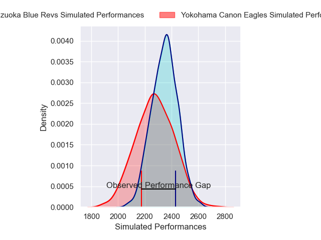
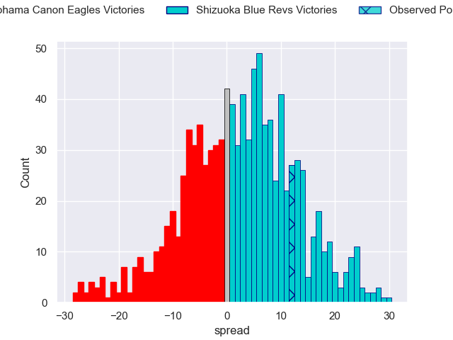

---  
layout: page  
title: Yokohama Canon Eagles V Shizuoka Blue Revs on 2025/12/14  
date: 2025-12-14  
categories: "Japan Rugby League One 25/26" match projection  
---
# Yokohama Canon Eagles V Shizuoka Blue Revs on 2025/12/14, 27.0 to 39.0

# Club Level Predictions

Now that the game has been played, lets see how the club predictions did. I predicted Shizuoka Blue Revs to win by 2.14, and Shizuoka Blue Revs won by 12.0. That's an absolute error of 9.9 for the margin of victory, while my average absolute error has been 13.9 over the past six months. This prediction was more accurate than 50.4% of my recent predictions.

For the Over/Under model, I predicted a total of 61.5 and we have an actual total of 66.0. That's an absolute error of 4.5 compared to a six month average of 12.9. This prediction was more accurate than 77.5% of my recent predictions.
## Projected Performances - Club Model

## Projected Spreads - Club Model

## Projected Results - Club Model

