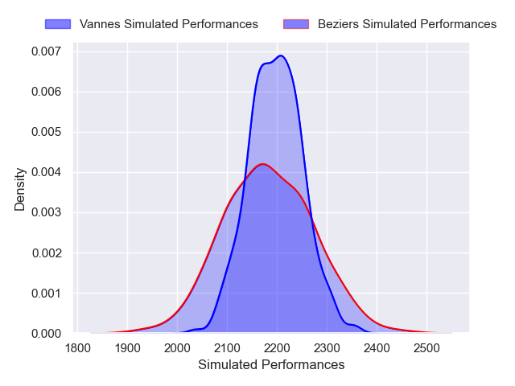

---  
layout: page  
title: Beziers V Vannes on 2025/12/18  
date: 2025-12-18  
categories: "Pro D2 25/26" match projection  
---
# Beziers V Vannes on 2025/12/18, 23.0 to 17.0

# Club Level Predictions

Now that the game has been played, lets see how the club predictions did. I predicted Vannes to win by 1.1, and Beziers won by 6.0. That's an absolute error of 7.1 for the margin of victory, while my average absolute error has been 13.9 over the past six months. This prediction was more accurate than 63.8% of my recent predictions.

For the Over/Under model, I predicted a total of 50.5 and we have an actual total of 40.0. That's an absolute error of 10.5 compared to a six month average of 13.0. This prediction was more accurate than 50.1% of my recent predictions.
## Projected Performances - Club Model

## Projected Spreads - Club Model

## Projected Results - Club Model

