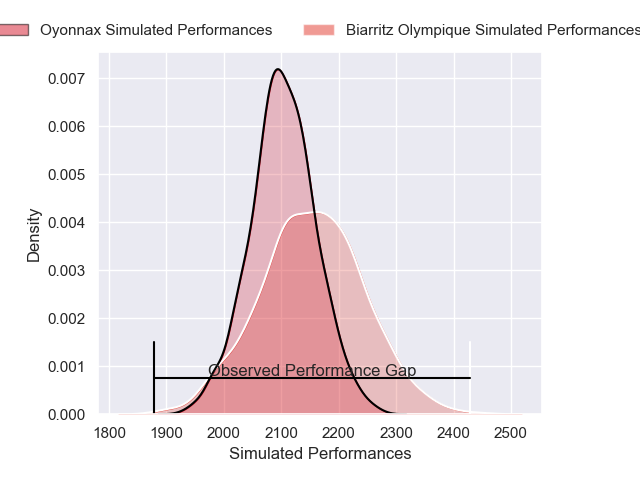
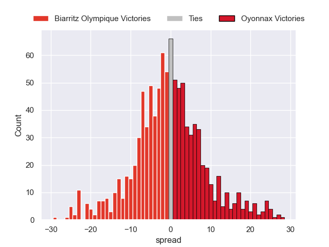

---  
layout: page  
title: Biarritz Olympique V Oyonnax on 2025/12/19  
date: 2025-12-19  
categories: "Pro D2 25/26" match projection  
---
# Biarritz Olympique V Oyonnax on 2025/12/19, 42.0 to 17.0

# Club Level Predictions

Now that the game has been played, lets see how the club predictions did. I predicted Biarritz Olympique to win by 1.52, and Biarritz Olympique won by 25.0. That's an absolute error of 23.5 for the margin of victory, while my average absolute error has been 13.9 over the past six months. This prediction was more accurate than 18.5% of my recent predictions.

For the Over/Under model, I predicted a total of 50.5 and we have an actual total of 59.0. That's an absolute error of 8.5 compared to a six month average of 12.8. This prediction was more accurate than 58.3% of my recent predictions.
## Projected Performances - Club Model

## Projected Spreads - Club Model

## Projected Results - Club Model

