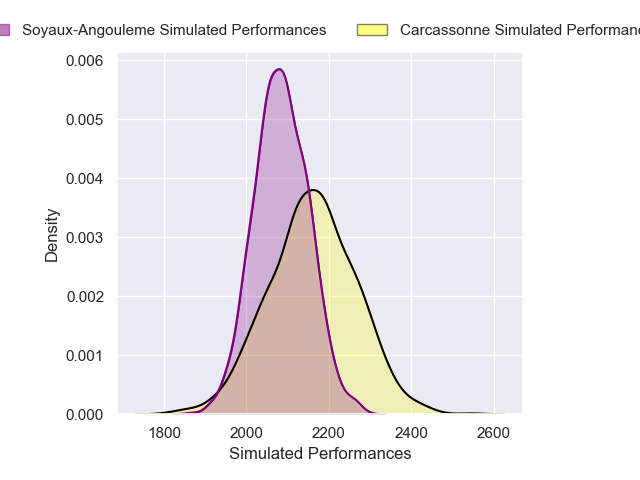
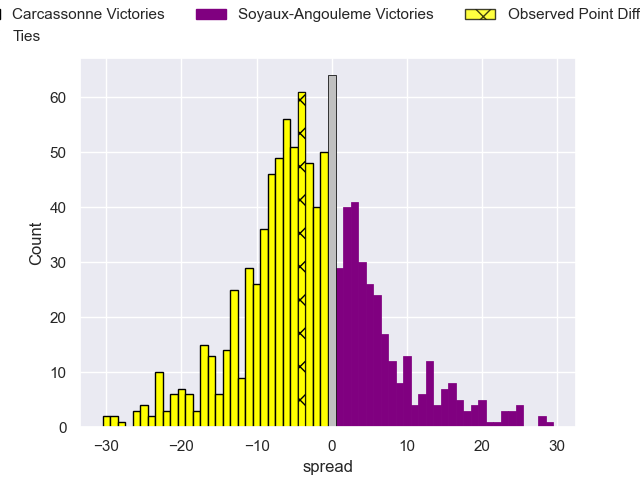
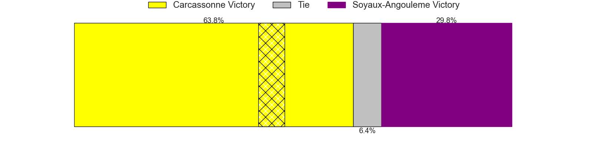

---  
layout: page  
title: Carcassonne V Soyaux-Angouleme on 2025/12/19  
date: 2025-12-19  
categories: "Pro D2 25/26" match projection  
---
# Carcassonne V Soyaux-Angouleme on 2025/12/19, 35.0 to 31.0

# Club Level Predictions

Now that the game has been played, lets see how the club predictions did. I predicted Carcassonne to win by 2.45, and Carcassonne won by 4.0. That's an absolute error of 1.5 for the margin of victory, while my average absolute error has been 13.8 over the past six months. This prediction was more accurate than 91.2% of my recent predictions.

For the Over/Under model, I predicted a total of 47.5 and we have an actual total of 66.0. That's an absolute error of 18.5 compared to a six month average of 12.8. This prediction was more accurate than 24.3% of my recent predictions.
## Projected Performances - Club Model

## Projected Spreads - Club Model

## Projected Results - Club Model

