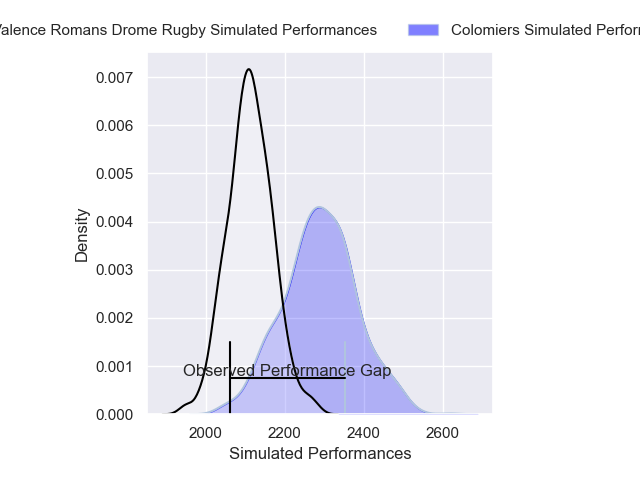
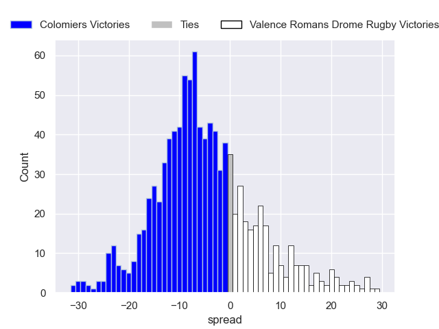

---  
layout: page  
title: Colomiers V Valence Romans Drome Rugby on 2025/12/19  
date: 2025-12-19  
categories: "Pro D2 25/26" match projection  
---
# Colomiers V Valence Romans Drome Rugby on 2025/12/19, 24.0 to 10.0

# Club Level Predictions

Now that the game has been played, lets see how the club predictions did. I predicted Colomiers to win by 5.73, and Colomiers won by 14.0. That's an absolute error of 8.3 for the margin of victory, while my average absolute error has been 13.8 over the past six months. This prediction was more accurate than 57.4% of my recent predictions.

For the Over/Under model, I predicted a total of 45.5 and we have an actual total of 34.0. That's an absolute error of 11.5 compared to a six month average of 12.8. This prediction was more accurate than 45.2% of my recent predictions.
## Projected Performances - Club Model

## Projected Spreads - Club Model

## Projected Results - Club Model

