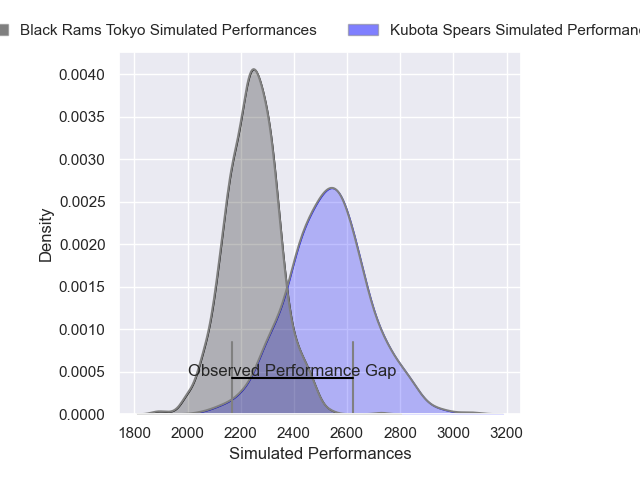
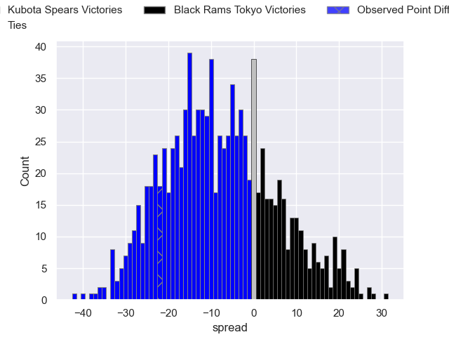
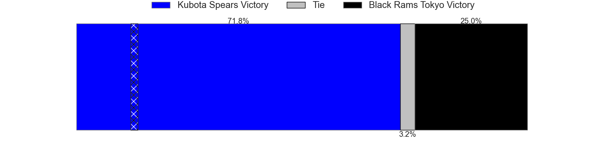

---  
layout: page  
title: Kubota Spears V Black Rams Tokyo on 2025/12/19  
date: 2025-12-19  
categories: "Japan Rugby League One 25/26" match projection  
---
# Kubota Spears V Black Rams Tokyo on 2025/12/19, 50.0 to 28.0

# Club Level Predictions

Now that the game has been played, lets see how the club predictions did. I predicted Kubota Spears to win by 7.53, and Kubota Spears won by 22.0. That's an absolute error of 14.5 for the margin of victory, while my average absolute error has been 13.9 over the past six months. This prediction was more accurate than 36.4% of my recent predictions.

For the Over/Under model, I predicted a total of 53.5 and we have an actual total of 78.0. That's an absolute error of 24.5 compared to a six month average of 12.8. This prediction was more accurate than 12.8% of my recent predictions.
## Projected Performances - Club Model

## Projected Spreads - Club Model

## Projected Results - Club Model

