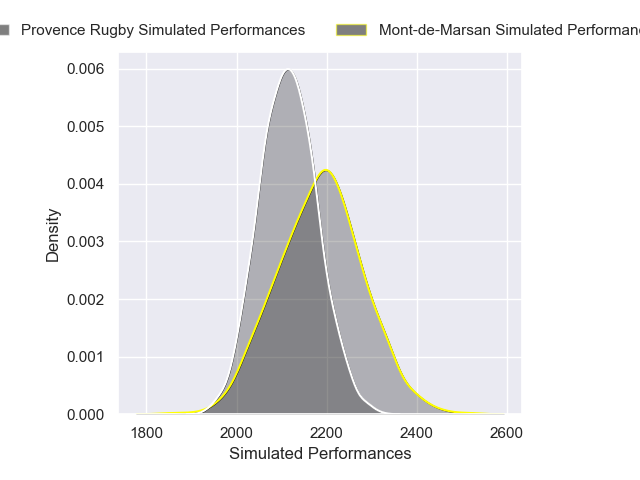
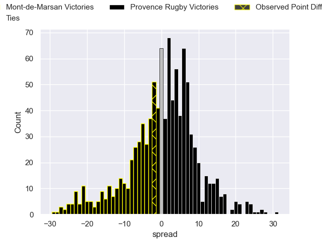

---  
layout: page  
title: Mont-de-Marsan V Provence Rugby on 2025/12/19  
date: 2025-12-19  
categories: "Pro D2 25/26" match projection  
---
# Mont-de-Marsan V Provence Rugby on 2025/12/19, 25.0 to 23.0

# Club Level Predictions

Now that the game has been played, lets see how the club predictions did. I predicted Provence Rugby to win by 0.86, and Mont-de-Marsan won by 2.0. That's an absolute error of 2.9 for the margin of victory, while my average absolute error has been 13.8 over the past six months. This prediction was more accurate than 85.6% of my recent predictions.

For the Over/Under model, I predicted a total of 51.5 and we have an actual total of 48.0. That's an absolute error of 3.5 compared to a six month average of 12.8. This prediction was more accurate than 82.7% of my recent predictions.
## Projected Performances - Club Model

## Projected Spreads - Club Model

## Projected Results - Club Model

