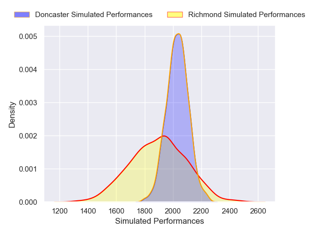
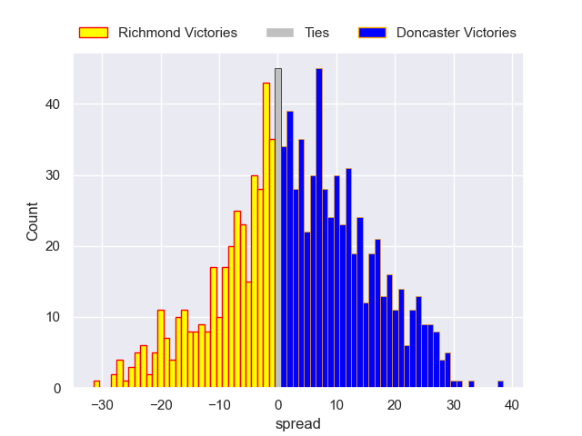

---  
layout: page  
title: Richmond V Doncaster on 2025/12/19  
date: 2025-12-19  
categories: "RFU Championship 25/26" match projection  
---
# Richmond V Doncaster on 2025/12/19, 7.0 to 31.0

# Club Level Predictions

Now that the game has been played, lets see how the club predictions did. I predicted Doncaster to win by 3.02, and Doncaster won by 24.0. That's an absolute error of 21.0 for the margin of victory, while my average absolute error has been 13.9 over the past six months. This prediction was more accurate than 23.0% of my recent predictions.

For the Over/Under model, I predicted a total of 53.5 and we have an actual total of 38.0. That's an absolute error of 15.5 compared to a six month average of 13.0. This prediction was more accurate than 32.8% of my recent predictions.
## Projected Performances - Club Model

## Projected Spreads - Club Model

## Projected Results - Club Model

