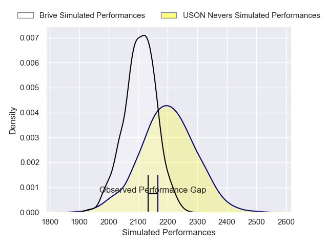
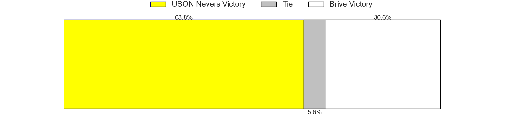

---  
layout: page  
title: USON Nevers V Brive on 2025/12/19  
date: 2025-12-19  
categories: "Pro D2 25/26" match projection  
---
# USON Nevers V Brive on 2025/12/19, 33.0 to 31.0

# Club Level Predictions

Now that the game has been played, lets see how the club predictions did. I predicted USON Nevers to win by 2.68, and USON Nevers won by 2.0. That's an absolute error of 0.7 for the margin of victory, while my average absolute error has been 13.8 over the past six months. This prediction was more accurate than 96.4% of my recent predictions.

For the Over/Under model, I predicted a total of 46.5 and we have an actual total of 64.0. That's an absolute error of 17.5 compared to a six month average of 12.8. This prediction was more accurate than 26.3% of my recent predictions.
## Projected Performances - Club Model

## Projected Spreads - Club Model

## Projected Results - Club Model

