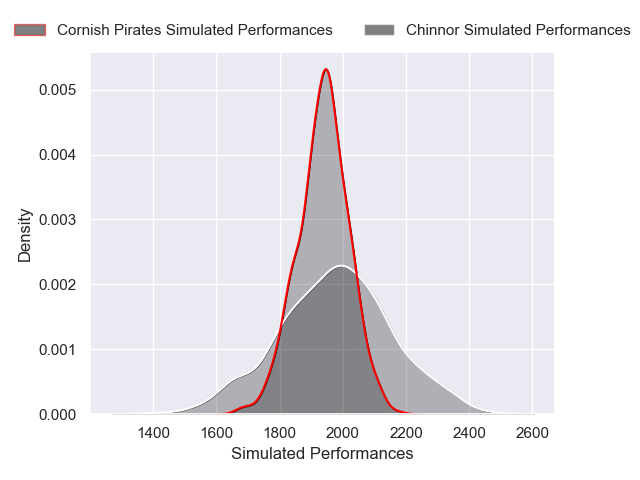

---  
layout: page  
title: Chinnor V Cornish Pirates on 2025/12/20  
date: 2025-12-20  
categories: "RFU Championship 25/26" match projection  
---
# Chinnor V Cornish Pirates on 2025/12/20, 47.0 to 10.0

# Club Level Predictions

Now that the game has been played, lets see how the club predictions did. I predicted Chinnor to win by 1.54, and Chinnor won by 37.0. That's an absolute error of 35.5 for the margin of victory, while my average absolute error has been 13.8 over the past six months. This prediction was more accurate than 6.1% of my recent predictions.

For the Over/Under model, I predicted a total of 52.5 and we have an actual total of 57.0. That's an absolute error of 4.5 compared to a six month average of 12.8. This prediction was more accurate than 77.3% of my recent predictions.
## Projected Performances - Club Model

## Projected Spreads - Club Model

## Projected Results - Club Model

