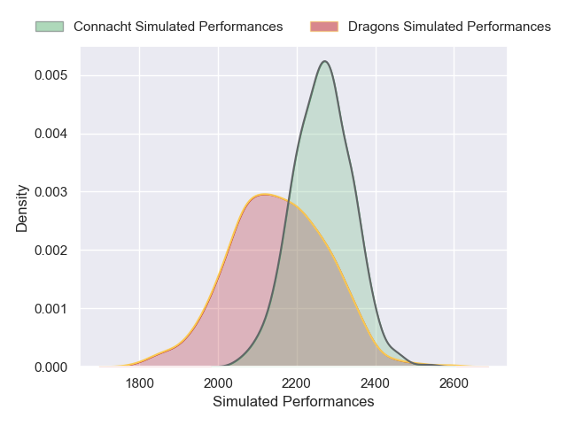
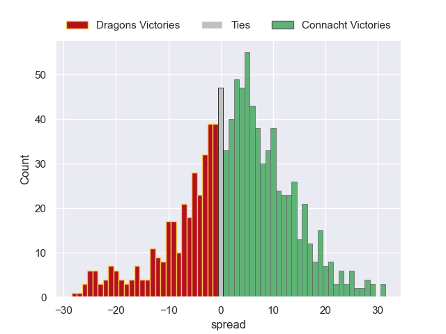

---  
layout: page  
title: Dragons V Connacht on 2025/12/20  
date: 2025-12-20  
categories: "United Rugby Championship 25/26" match projection  
---
# Dragons V Connacht on 2025/12/20, 48.0 to 28.0

# Club Level Predictions

Now that the game has been played, lets see how the club predictions did. I predicted Connacht to win by 3.84, and Dragons won by 20.0. That's an absolute error of 23.8 for the margin of victory, while my average absolute error has been 13.9 over the past six months. This prediction was more accurate than 17.9% of my recent predictions.

For the Over/Under model, I predicted a total of 51.5 and we have an actual total of 76.0. That's an absolute error of 24.5 compared to a six month average of 12.8. This prediction was more accurate than 12.8% of my recent predictions.
## Projected Performances - Club Model

## Projected Spreads - Club Model

## Projected Results - Club Model

