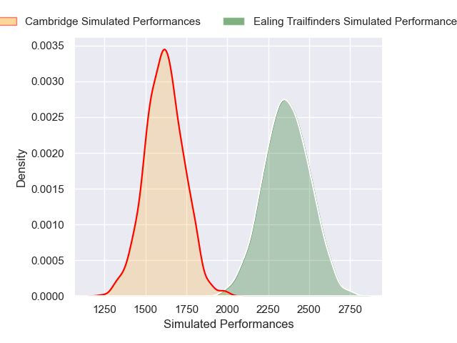
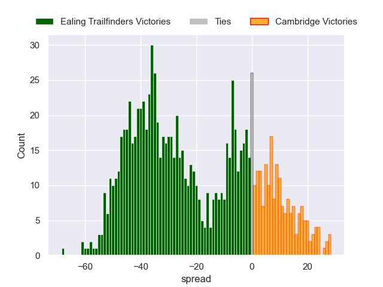

---  
layout: page  
title: Ealing Trailfinders V Cambridge on 2025/12/20  
date: 2025-12-20  
categories: "RFU Championship 25/26" match projection  
---
# Ealing Trailfinders V Cambridge on 2025/12/20, 68.0 to 17.0

# Club Level Predictions

Now that the game has been played, lets see how the club predictions did. I predicted Ealing Trailfinders to win by 23.61, and Ealing Trailfinders won by 51.0. That's an absolute error of 27.4 for the margin of victory, while my average absolute error has been 13.9 over the past six months. This prediction was more accurate than 13.2% of my recent predictions.

For the Over/Under model, I predicted a total of 67.5 and we have an actual total of 85.0. That's an absolute error of 17.5 compared to a six month average of 13.0. This prediction was more accurate than 26.9% of my recent predictions.
## Projected Performances - Club Model

## Projected Spreads - Club Model

## Projected Results - Club Model

