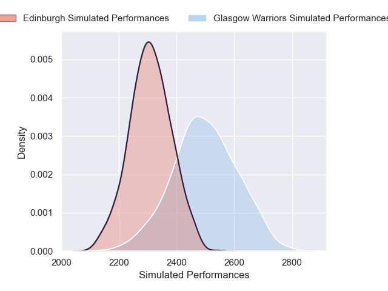
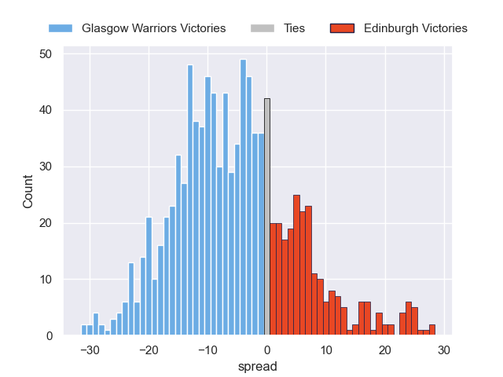

---  
layout: page  
title: Glasgow Warriors V Edinburgh on 2025/12/20  
date: 2025-12-20  
categories: "United Rugby Championship 25/26" match projection  
---
# Glasgow Warriors V Edinburgh on 2025/12/20, 24.0 to 12.0

# Club Level Predictions

Now that the game has been played, lets see how the club predictions did. I predicted Glasgow Warriors to win by 4.67, and Glasgow Warriors won by 12.0. That's an absolute error of 7.3 for the margin of victory, while my average absolute error has been 13.8 over the past six months. This prediction was more accurate than 62.7% of my recent predictions.

For the Over/Under model, I predicted a total of 45.5 and we have an actual total of 36.0. That's an absolute error of 9.5 compared to a six month average of 12.8. This prediction was more accurate than 54.6% of my recent predictions.
## Projected Performances - Club Model

## Projected Spreads - Club Model

## Projected Results - Club Model

