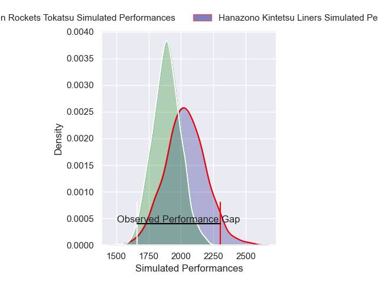
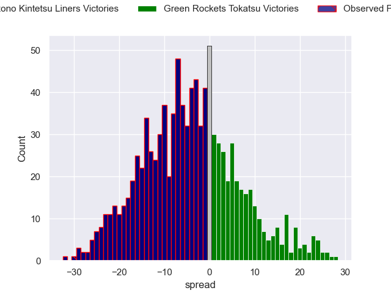
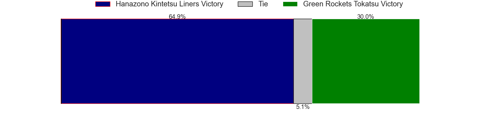

---  
layout: page  
title: Hanazono Kintetsu Liners V Green Rockets Tokatsu on 2025/12/20  
date: 2025-12-20  
categories: "Japan Rugby League One D2 25/26" match projection  
---
# Hanazono Kintetsu Liners V Green Rockets Tokatsu on 2025/12/20, 40.0 to 10.0

# Club Level Predictions

Now that the game has been played, lets see how the club predictions did. I predicted Hanazono Kintetsu Liners to win by 4.55, and Hanazono Kintetsu Liners won by 30.0. That's an absolute error of 25.4 for the margin of victory, while my average absolute error has been 13.9 over the past six months. This prediction was more accurate than 16.0% of my recent predictions.

For the Over/Under model, I predicted a total of 54.5 and we have an actual total of 50.0. That's an absolute error of 4.5 compared to a six month average of 13.0. This prediction was more accurate than 77.4% of my recent predictions.
## Projected Performances - Club Model

## Projected Spreads - Club Model

## Projected Results - Club Model

