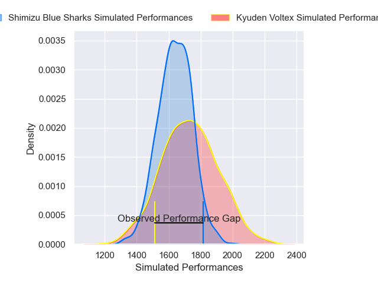
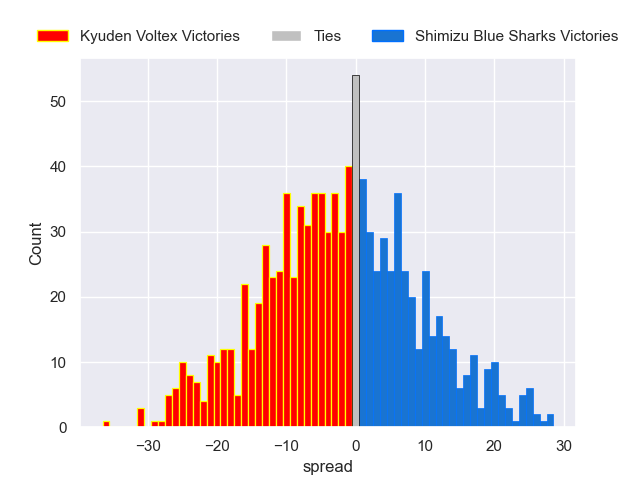

---  
layout: page  
title: Kyuden Voltex V Shimizu Blue Sharks on 2025/12/20  
date: 2025-12-20  
categories: "Japan Rugby League One D2 25/26" match projection  
---
# Kyuden Voltex V Shimizu Blue Sharks on 2025/12/20, 27.0 to 40.0

# Club Level Predictions

Now that the game has been played, lets see how the club predictions did. I predicted Kyuden Voltex to win by 2.74, and Shimizu Blue Sharks won by 13.0. That's an absolute error of 15.7 for the margin of victory, while my average absolute error has been 13.9 over the past six months. This prediction was more accurate than 33.2% of my recent predictions.

For the Over/Under model, I predicted a total of 52.5 and we have an actual total of 67.0. That's an absolute error of 14.5 compared to a six month average of 13.0. This prediction was more accurate than 35.8% of my recent predictions.
## Projected Performances - Club Model

## Projected Spreads - Club Model

## Projected Results - Club Model

