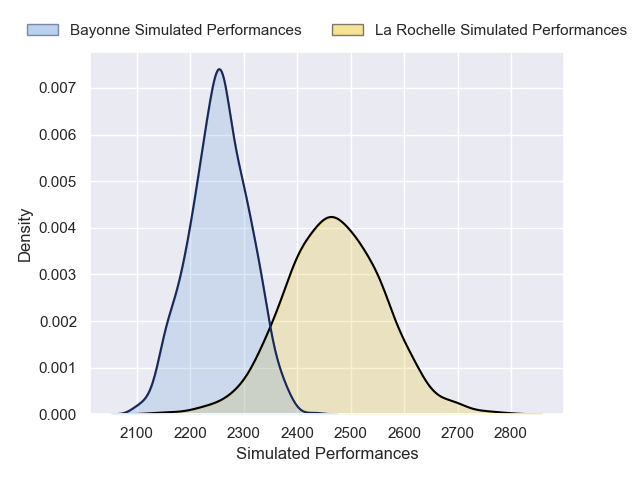
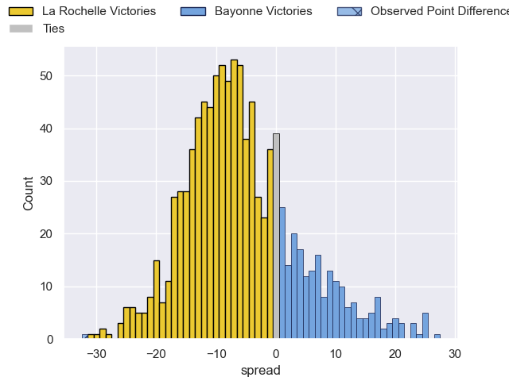
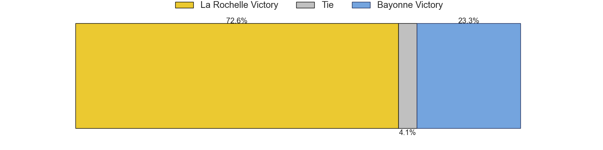

---  
layout: page  
title: La Rochelle V Bayonne on 2025/12/20  
date: 2025-12-20  
categories: "Top 14 25/26" match projection  
---
# La Rochelle V Bayonne on 2025/12/20, 49.0 to 17.0

# Club Level Predictions

Now that the game has been played, lets see how the club predictions did. I predicted La Rochelle to win by 5.4, and La Rochelle won by 32.0. That's an absolute error of 26.6 for the margin of victory, while my average absolute error has been 13.8 over the past six months. This prediction was more accurate than 13.8% of my recent predictions.

For the Over/Under model, I predicted a total of 55.5 and we have an actual total of 66.0. That's an absolute error of 10.5 compared to a six month average of 12.8. This prediction was more accurate than 48.8% of my recent predictions.
## Projected Performances - Club Model

## Projected Spreads - Club Model

## Projected Results - Club Model

