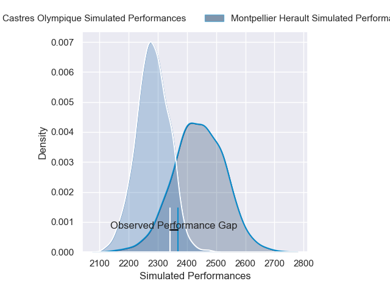
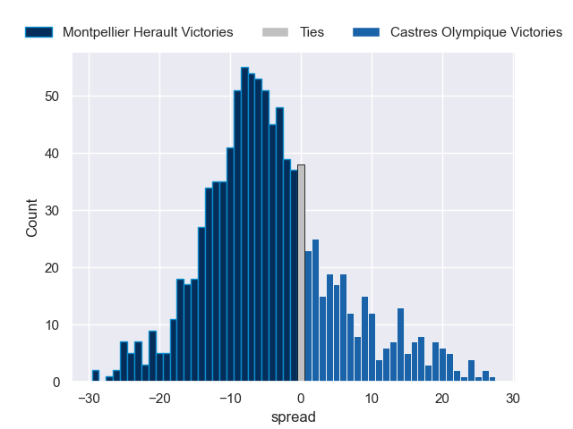

---  
layout: page  
title: Montpellier Herault V Castres Olympique on 2025/12/20  
date: 2025-12-20  
categories: "Top 14 25/26" match projection  
---
# Montpellier Herault V Castres Olympique on 2025/12/20, 33.0 to 31.0

# Club Level Predictions

Now that the game has been played, lets see how the club predictions did. I predicted Montpellier Herault to win by 4.65, and Montpellier Herault won by 2.0. That's an absolute error of 2.7 for the margin of victory, while my average absolute error has been 13.9 over the past six months. This prediction was more accurate than 86.8% of my recent predictions.

For the Over/Under model, I predicted a total of 45.5 and we have an actual total of 64.0. That's an absolute error of 18.5 compared to a six month average of 12.8. This prediction was more accurate than 24.6% of my recent predictions.
## Projected Performances - Club Model

## Projected Spreads - Club Model

## Projected Results - Club Model

