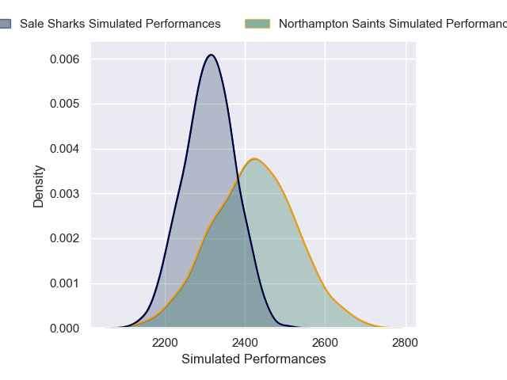

---  
layout: page  
title: Northampton Saints V Sale Sharks on 2025/12/20  
date: 2025-12-20  
categories: "Gallagher Premiership 25/26" match projection  
---
# Northampton Saints V Sale Sharks on 2025/12/20, 47.0 to 21.0

# Club Level Predictions

Now that the game has been played, lets see how the club predictions did. I predicted Northampton Saints to win by 1.9, and Northampton Saints won by 26.0. That's an absolute error of 24.1 for the margin of victory, while my average absolute error has been 13.9 over the past six months. This prediction was more accurate than 17.8% of my recent predictions.

For the Over/Under model, I predicted a total of 51.5 and we have an actual total of 68.0. That's an absolute error of 16.5 compared to a six month average of 12.8. This prediction was more accurate than 28.9% of my recent predictions.
## Projected Performances - Club Model

## Projected Spreads - Club Model

## Projected Results - Club Model

