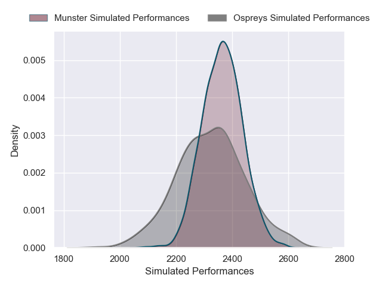
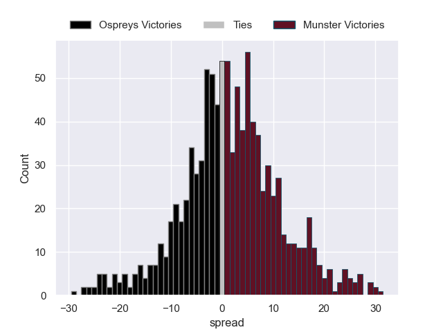

---  
layout: page  
title: Ospreys V Munster on 2025/12/20  
date: 2025-12-20  
categories: "United Rugby Championship 25/26" match projection  
---
# Ospreys V Munster on 2025/12/20, 10.0 to 26.0

# Club Level Predictions

Now that the game has been played, lets see how the club predictions did. I predicted Munster to win by 0.63, and Munster won by 16.0. That's an absolute error of 15.4 for the margin of victory, while my average absolute error has been 13.9 over the past six months. This prediction was more accurate than 34.8% of my recent predictions.

For the Over/Under model, I predicted a total of 43.5 and we have an actual total of 36.0. That's an absolute error of 7.5 compared to a six month average of 13.0. This prediction was more accurate than 63.4% of my recent predictions.
## Projected Performances - Club Model

## Projected Spreads - Club Model

## Projected Results - Club Model

