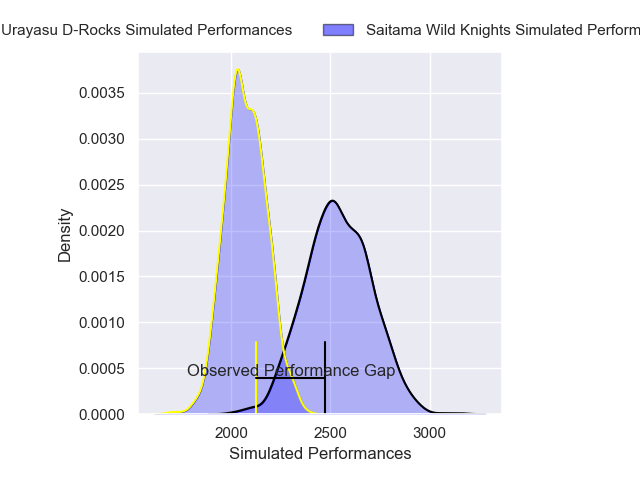

---  
layout: page  
title: Saitama Wild Knights V Urayasu D-Rocks on 2025/12/20  
date: 2025-12-20  
categories: "Japan Rugby League One 25/26" match projection  
---
# Saitama Wild Knights V Urayasu D-Rocks on 2025/12/20, 37.0 to 19.0

# Club Level Predictions

Now that the game has been played, lets see how the club predictions did. I predicted Saitama Wild Knights to win by 13.09, and Saitama Wild Knights won by 18.0. That's an absolute error of 4.9 for the margin of victory, while my average absolute error has been 13.9 over the past six months. This prediction was more accurate than 74.8% of my recent predictions.

For the Over/Under model, I predicted a total of 57.5 and we have an actual total of 56.0. That's an absolute error of 1.5 compared to a six month average of 12.8. This prediction was more accurate than 92.4% of my recent predictions.
## Projected Performances - Club Model

## Projected Spreads - Club Model

## Projected Results - Club Model

