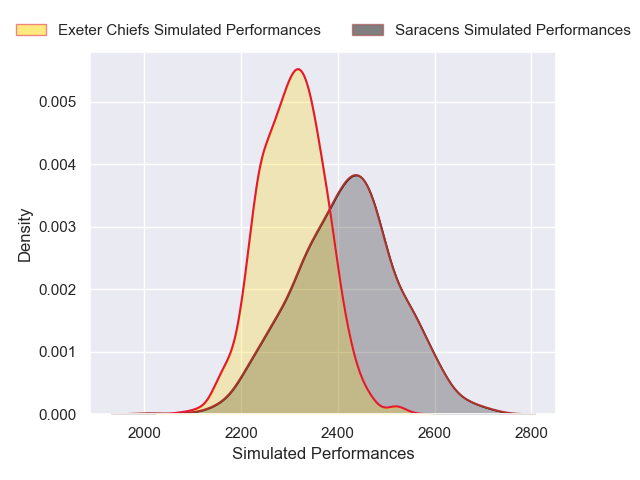
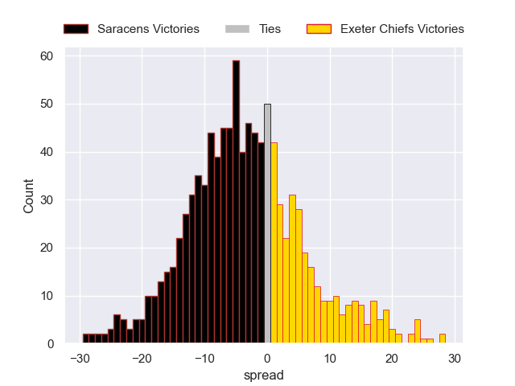

---  
layout: page  
title: Saracens V Exeter Chiefs on 2025/12/20  
date: 2025-12-20  
categories: "Gallagher Premiership 25/26" match projection  
---
# Saracens V Exeter Chiefs on 2025/12/20, 24.0 to 30.0

# Club Level Predictions

Now that the game has been played, lets see how the club predictions did. I predicted Saracens to win by 3.92, and Exeter Chiefs won by 6.0. That's an absolute error of 9.9 for the margin of victory, while my average absolute error has been 13.9 over the past six months. This prediction was more accurate than 49.8% of my recent predictions.

For the Over/Under model, I predicted a total of 53.5 and we have an actual total of 54.0. That's an absolute error of 0.5 compared to a six month average of 12.8. This prediction was more accurate than 97.3% of my recent predictions.
## Projected Performances - Club Model

## Projected Spreads - Club Model

## Projected Results - Club Model

