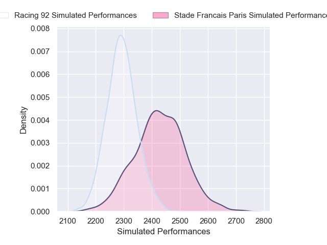
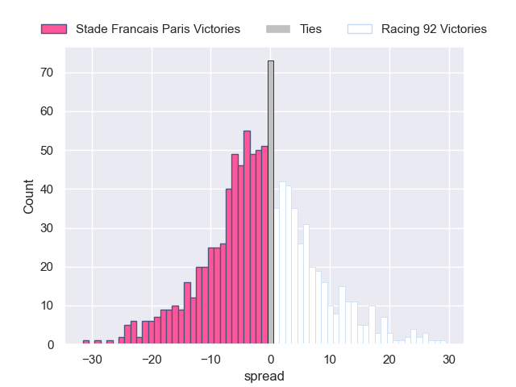

---  
layout: page  
title: Stade Francais Paris V Racing 92 on 2025/12/20  
date: 2025-12-20  
categories: "Top 14 25/26" match projection  
---
# Stade Francais Paris V Racing 92 on 2025/12/20, 20.0 to 20.0

# Club Level Predictions

Now that the game has been played, lets see how the club predictions did. I predicted Stade Francais Paris to win by 2.68, and Racing 92 won by 0.0. That's an absolute error of 2.7 for the margin of victory, while my average absolute error has been 13.9 over the past six months. This prediction was more accurate than 86.9% of my recent predictions.

For the Over/Under model, I predicted a total of 52.5 and we have an actual total of 40.0. That's an absolute error of 12.5 compared to a six month average of 13.0. This prediction was more accurate than 43.0% of my recent predictions.
## Projected Performances - Club Model

## Projected Spreads - Club Model

## Projected Results - Club Model

