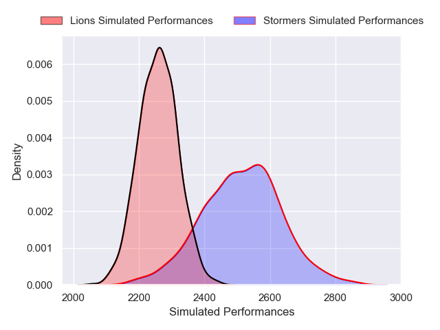
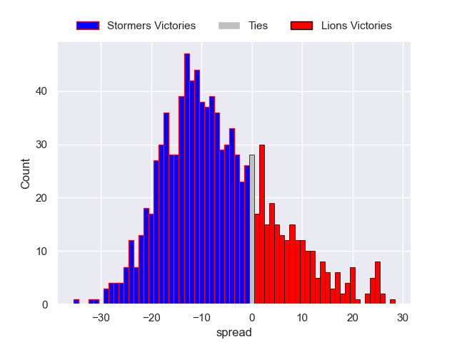
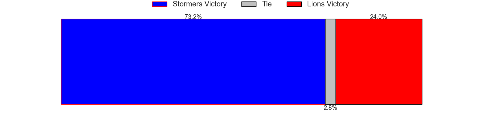

---  
layout: page  
title: Stormers V Lions on 2025/12/20  
date: 2025-12-20  
categories: "United Rugby Championship 25/26" match projection  
---
# Stormers V Lions on 2025/12/20, 34.0 to 27.0

# Club Level Predictions

Now that the game has been played, lets see how the club predictions did. I predicted Stormers to win by 6.81, and Stormers won by 7.0. That's an absolute error of 0.2 for the margin of victory, while my average absolute error has been 13.9 over the past six months. This prediction was more accurate than 98.8% of my recent predictions.

For the Over/Under model, I predicted a total of 47.5 and we have an actual total of 61.0. That's an absolute error of 13.5 compared to a six month average of 12.8. This prediction was more accurate than 38.7% of my recent predictions.
## Projected Performances - Club Model

## Projected Spreads - Club Model

## Projected Results - Club Model

