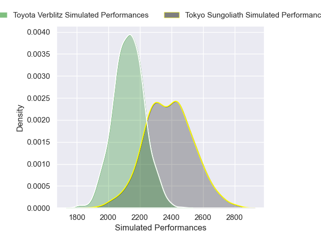
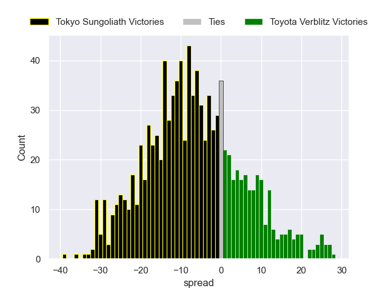

---  
layout: page  
title: Tokyo Sungoliath V Toyota Verblitz on 2025/12/20  
date: 2025-12-20  
categories: "Japan Rugby League One 25/26" match projection  
---
# Tokyo Sungoliath V Toyota Verblitz on 2025/12/20, 43.0 to 25.0

# Club Level Predictions

Now that the game has been played, lets see how the club predictions did. I predicted Tokyo Sungoliath to win by 6.17, and Tokyo Sungoliath won by 18.0. That's an absolute error of 11.8 for the margin of victory, while my average absolute error has been 13.9 over the past six months. This prediction was more accurate than 44.3% of my recent predictions.

For the Over/Under model, I predicted a total of 57.5 and we have an actual total of 68.0. That's an absolute error of 10.5 compared to a six month average of 13.0. This prediction was more accurate than 50.1% of my recent predictions.
## Projected Performances - Club Model

## Projected Spreads - Club Model

## Projected Results - Club Model

