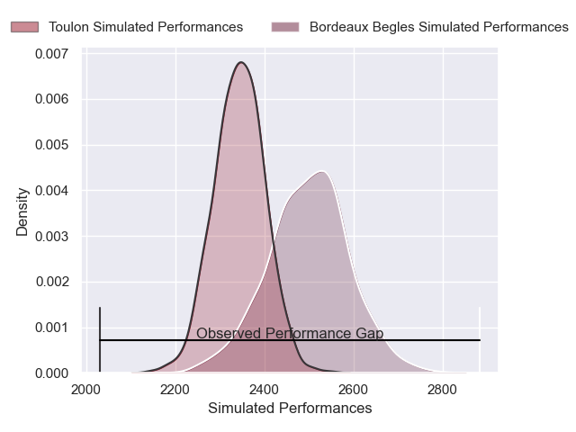
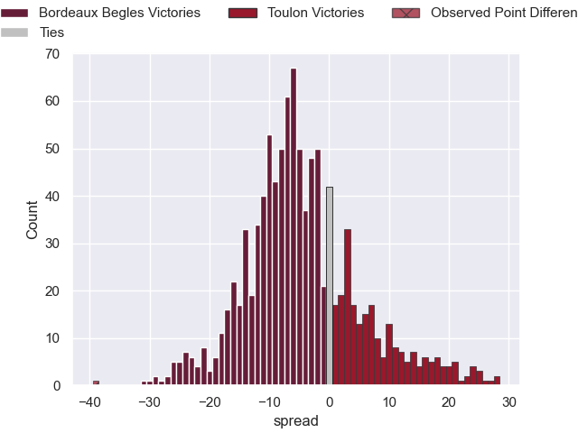

---  
layout: page  
title: Bordeaux Begles V Toulon on 2025/12/19  
date: 2025-12-21  
categories: "Top 14 25/26" match projection  
---
# Bordeaux Begles V Toulon on 2025/12/19, 46.0 to 7.0

# Club Level Predictions

Now that the game has been played, lets see how the club predictions did. I predicted Bordeaux Begles to win by 4.22, and Bordeaux Begles won by 39.0. That's an absolute error of 34.8 for the margin of victory, while my average absolute error has been 13.9 over the past six months. This prediction was more accurate than 6.8% of my recent predictions.

For the Over/Under model, I predicted a total of 55.5 and we have an actual total of 53.0. That's an absolute error of 2.5 compared to a six month average of 12.8. This prediction was more accurate than 87.4% of my recent predictions.
## Projected Performances - Club Model

## Projected Spreads - Club Model

## Projected Results - Club Model

