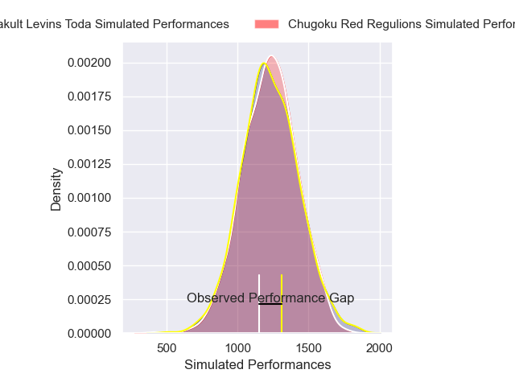
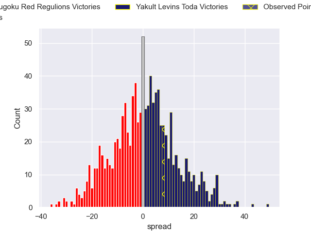

---  
layout: page  
title: Chugoku Red Regulions V Yakult Levins Toda on 2025/12/21  
date: 2025-12-21  
categories: "Japan Rugby League One D3 25/26" match projection  
---
# Chugoku Red Regulions V Yakult Levins Toda on 2025/12/21, 10.0 to 18.0

# Club Level Predictions

Now that the game has been played, lets see how the club predictions did. I predicted Chugoku Red Regulions to win by 0.19, and Yakult Levins Toda won by 8.0. That's an absolute error of 8.2 for the margin of victory, while my average absolute error has been 13.8 over the past six months. This prediction was more accurate than 58.0% of my recent predictions.

For the Over/Under model, I predicted a total of 46.5 and we have an actual total of 28.0. That's an absolute error of 18.5 compared to a six month average of 12.8. This prediction was more accurate than 24.3% of my recent predictions.
## Projected Performances - Club Model

## Projected Spreads - Club Model

## Projected Results - Club Model

