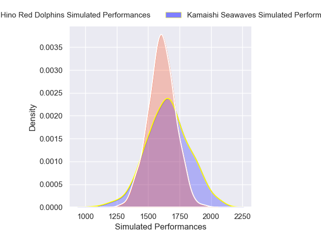
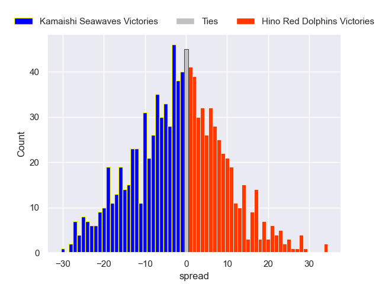
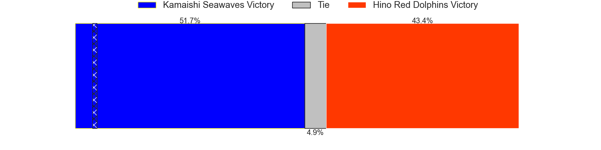

---  
layout: page  
title: Kamaishi Seawaves V Hino Red Dolphins on 2025/12/21  
date: 2025-12-21  
categories: "Japan Rugby League One D2 25/26" match projection  
---
# Kamaishi Seawaves V Hino Red Dolphins on 2025/12/21, 36.0 to 14.0

# Club Level Predictions

Now that the game has been played, lets see how the club predictions did. I predicted Kamaishi Seawaves to win by 1.84, and Kamaishi Seawaves won by 22.0. That's an absolute error of 20.2 for the margin of victory, while my average absolute error has been 13.9 over the past six months. This prediction was more accurate than 24.7% of my recent predictions.

For the Over/Under model, I predicted a total of 55.5 and we have an actual total of 50.0. That's an absolute error of 5.5 compared to a six month average of 13.0. This prediction was more accurate than 72.1% of my recent predictions.
## Projected Performances - Club Model

## Projected Spreads - Club Model

## Projected Results - Club Model

