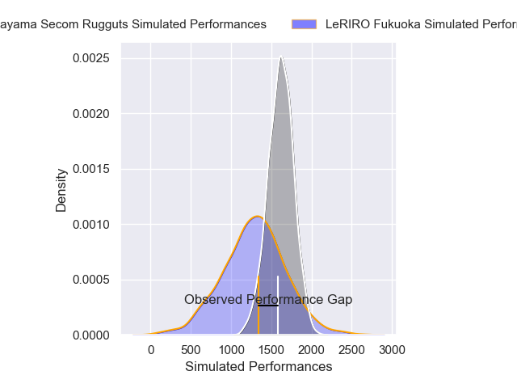
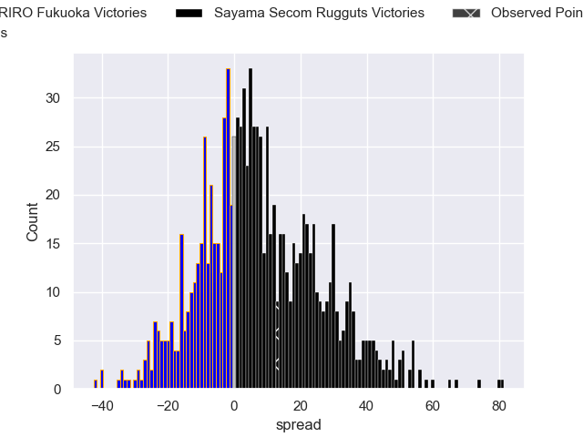
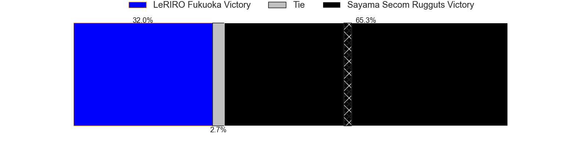

---  
layout: page  
title: LeRIRO Fukuoka V Sayama Secom Rugguts on 2025/12/21  
date: 2025-12-21  
categories: "Japan Rugby League One D3 25/26" match projection  
---
# LeRIRO Fukuoka V Sayama Secom Rugguts on 2025/12/21, 20.0 to 33.0

# Club Level Predictions

Now that the game has been played, lets see how the club predictions did. I predicted Sayama Secom Rugguts to win by 9.17, and Sayama Secom Rugguts won by 13.0. That's an absolute error of 3.8 for the margin of victory, while my average absolute error has been 13.9 over the past six months. This prediction was more accurate than 80.2% of my recent predictions.

For the Over/Under model, I predicted a total of 61.5 and we have an actual total of 53.0. That's an absolute error of 8.5 compared to a six month average of 12.8. This prediction was more accurate than 58.3% of my recent predictions.
## Projected Performances - Club Model

## Projected Spreads - Club Model

## Projected Results - Club Model

