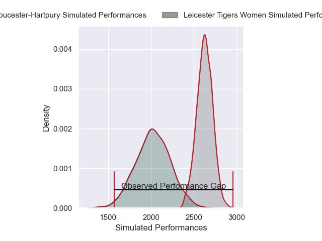
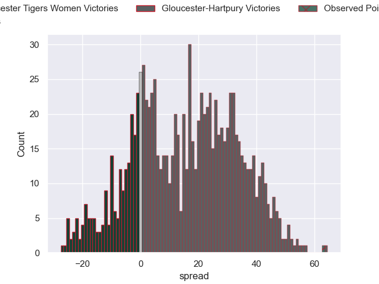

---  
layout: page  
title: Leicester Tigers Women V Gloucester-Hartpury on 2025/12/21  
date: 2025-12-21  
categories: "PWR 25/26" match projection  
---
# Leicester Tigers Women V Gloucester-Hartpury on 2025/12/21, 12.0 to 75.0

# Club Level Predictions

Now that the game has been played, lets see how the club predictions did. I predicted Gloucester-Hartpury to win by 15.55, and Gloucester-Hartpury won by 63.0. That's an absolute error of 47.4 for the margin of victory, while my average absolute error has been 13.9 over the past six months. This prediction was more accurate than 2.5% of my recent predictions.

For the Over/Under model, I predicted a total of 67.5 and we have an actual total of 87.0. That's an absolute error of 19.5 compared to a six month average of 12.8. This prediction was more accurate than 22.8% of my recent predictions.
## Projected Performances - Club Model

## Projected Spreads - Club Model

## Projected Results - Club Model

