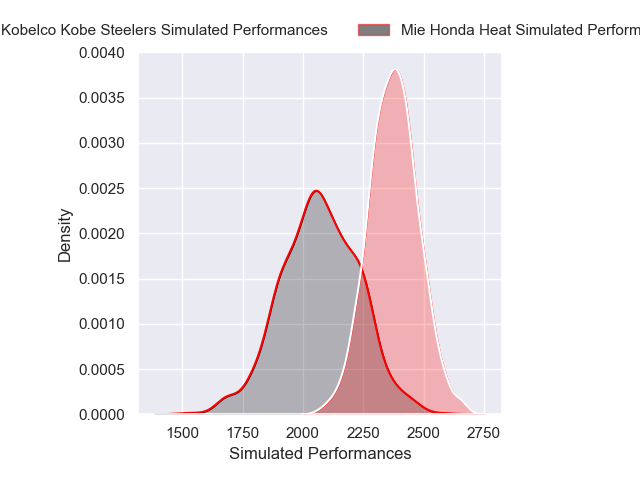
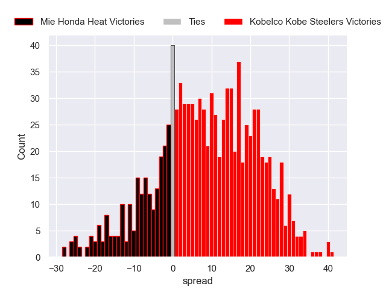
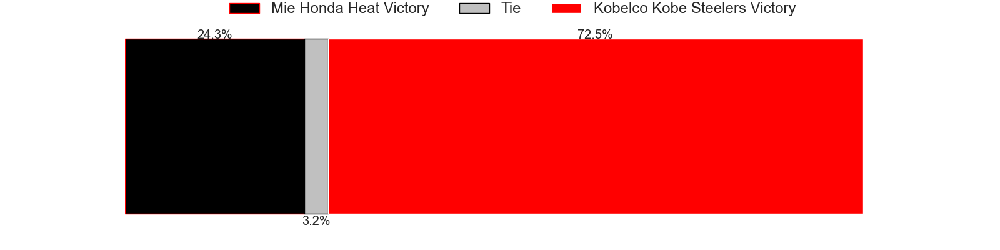

---  
layout: page  
title: Mie Honda Heat V Kobelco Kobe Steelers on 2025/12/21  
date: 2025-12-21  
categories: "Japan Rugby League One 25/26" match projection  
---
# Mie Honda Heat V Kobelco Kobe Steelers on 2025/12/21, 23.0 to 28.0

# Club Level Predictions

Now that the game has been played, lets see how the club predictions did. I predicted Kobelco Kobe Steelers to win by 8.41, and Kobelco Kobe Steelers won by 5.0. That's an absolute error of 3.4 for the margin of victory, while my average absolute error has been 13.9 over the past six months. This prediction was more accurate than 83.0% of my recent predictions.

For the Over/Under model, I predicted a total of 66.5 and we have an actual total of 51.0. That's an absolute error of 15.5 compared to a six month average of 13.0. This prediction was more accurate than 32.8% of my recent predictions.
## Projected Performances - Club Model

## Projected Spreads - Club Model

## Projected Results - Club Model

