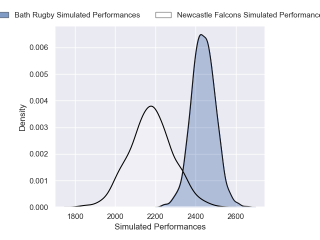
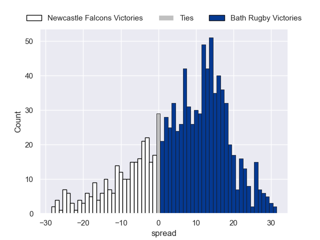
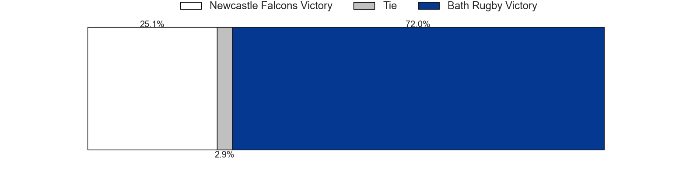

---  
layout: page  
title: Newcastle Falcons V Bath Rugby on 2025/12/21  
date: 2025-12-21  
categories: "Gallagher Premiership 25/26" match projection  
---
# Newcastle Falcons V Bath Rugby on 2025/12/21, 14.0 to 50.0

# Club Level Predictions

Now that the game has been played, lets see how the club predictions did. I predicted Bath Rugby to win by 8.86, and Bath Rugby won by 36.0. That's an absolute error of 27.1 for the margin of victory, while my average absolute error has been 13.9 over the past six months. This prediction was more accurate than 13.6% of my recent predictions.

For the Over/Under model, I predicted a total of 60.5 and we have an actual total of 64.0. That's an absolute error of 3.5 compared to a six month average of 13.0. This prediction was more accurate than 82.0% of my recent predictions.
## Projected Performances - Club Model

## Projected Spreads - Club Model

## Projected Results - Club Model

