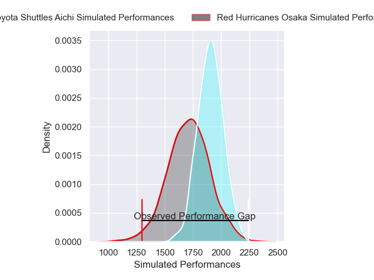
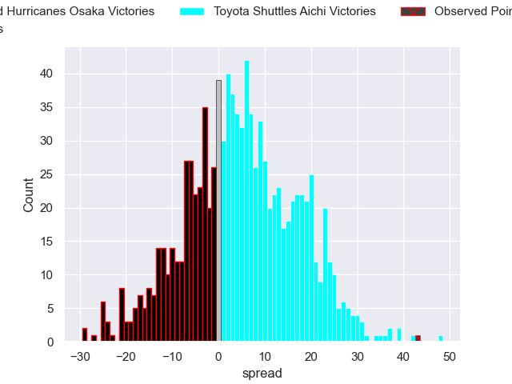
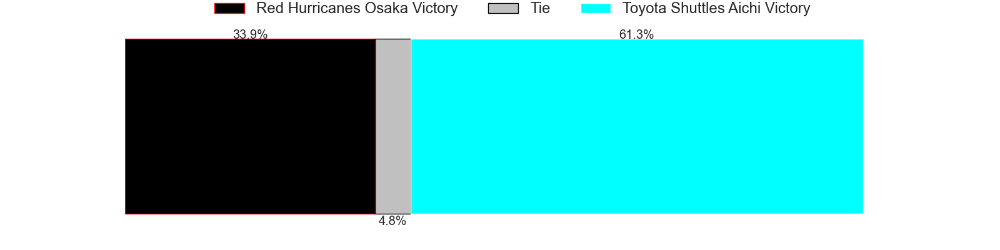

---  
layout: page  
title: Red Hurricanes Osaka V Toyota Shuttles Aichi on 2025/12/21  
date: 2025-12-21  
categories: "Japan Rugby League One D2 25/26" match projection  
---
# Red Hurricanes Osaka V Toyota Shuttles Aichi on 2025/12/21, 6.0 to 49.0

# Club Level Predictions

Now that the game has been played, lets see how the club predictions did. I predicted Toyota Shuttles Aichi to win by 5.27, and Toyota Shuttles Aichi won by 43.0. That's an absolute error of 37.7 for the margin of victory, while my average absolute error has been 13.9 over the past six months. This prediction was more accurate than 5.5% of my recent predictions.

For the Over/Under model, I predicted a total of 61.5 and we have an actual total of 55.0. That's an absolute error of 6.5 compared to a six month average of 12.8. This prediction was more accurate than 67.4% of my recent predictions.
## Projected Performances - Club Model

## Projected Spreads - Club Model

## Projected Results - Club Model

