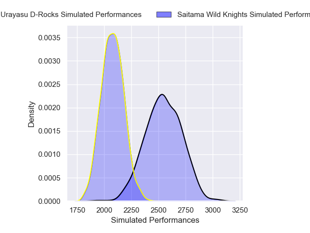
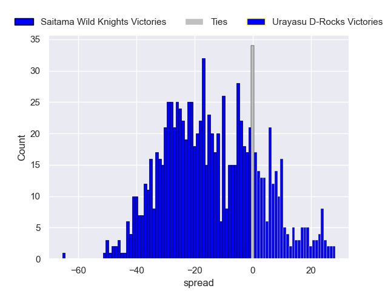

---  
layout: page  
title: Saitama Wild Knights V Urayasu D-Rocks on 2025/12/21  
date: 2025-12-21  
categories: "Japan Rugby League One 25/26" match projection  
---
# Saitama Wild Knights V Urayasu D-Rocks on 2025/12/21, 37.0 to 19.0

# Club Level Predictions

Now that the game has been played, lets see how the club predictions did. I predicted Saitama Wild Knights to win by 12.84, and Saitama Wild Knights won by 18.0. That's an absolute error of 5.2 for the margin of victory, while my average absolute error has been 13.9 over the past six months. This prediction was more accurate than 73.9% of my recent predictions.

For the Over/Under model, I predicted a total of 56.5 and we have an actual total of 56.0. That's an absolute error of 0.5 compared to a six month average of 13.0. This prediction was more accurate than 97.7% of my recent predictions.
## Projected Performances - Club Model

## Projected Spreads - Club Model

## Projected Results - Club Model

