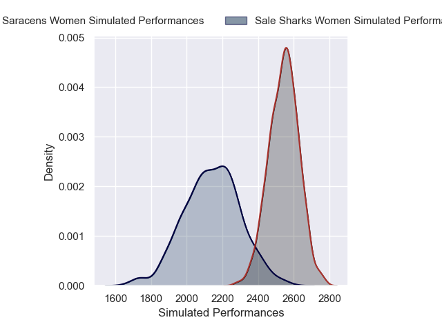
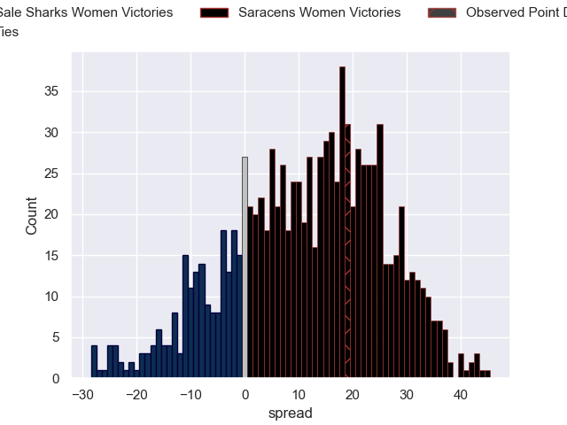
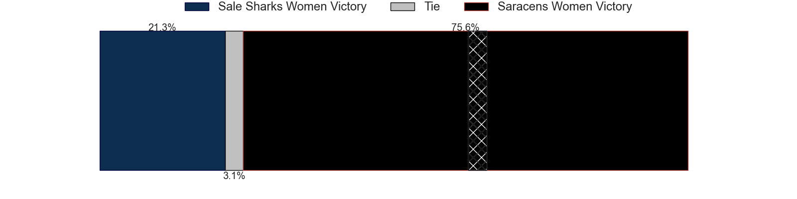

---  
layout: page  
title: Sale Sharks Women V Saracens Women on 2025/12/21  
date: 2025-12-21  
categories: "PWR 25/26" match projection  
---
# Sale Sharks Women V Saracens Women on 2025/12/21, 17.0 to 36.0

# Club Level Predictions

Now that the game has been played, lets see how the club predictions did. I predicted Saracens Women to win by 11.58, and Saracens Women won by 19.0. That's an absolute error of 7.4 for the margin of victory, while my average absolute error has been 13.8 over the past six months. This prediction was more accurate than 62.5% of my recent predictions.

For the Over/Under model, I predicted a total of 57.5 and we have an actual total of 53.0. That's an absolute error of 4.5 compared to a six month average of 12.8. This prediction was more accurate than 77.3% of my recent predictions.
## Projected Performances - Club Model

## Projected Spreads - Club Model

## Projected Results - Club Model

