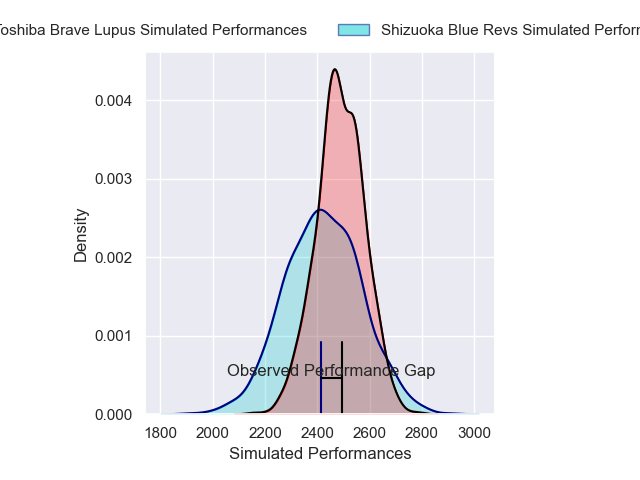
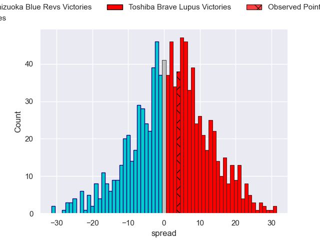

---  
layout: page  
title: Shizuoka Blue Revs V Toshiba Brave Lupus on 2025/12/21  
date: 2025-12-21  
categories: "Japan Rugby League One 25/26" match projection  
---
# Shizuoka Blue Revs V Toshiba Brave Lupus on 2025/12/21, 22.0 to 26.0

# Club Level Predictions

Now that the game has been played, lets see how the club predictions did. I predicted Toshiba Brave Lupus to win by 2.0, and Toshiba Brave Lupus won by 4.0. That's an absolute error of 2.0 for the margin of victory, while my average absolute error has been 13.9 over the past six months. This prediction was more accurate than 88.9% of my recent predictions.

For the Over/Under model, I predicted a total of 55.5 and we have an actual total of 48.0. That's an absolute error of 7.5 compared to a six month average of 13.0. This prediction was more accurate than 63.4% of my recent predictions.
## Projected Performances - Club Model

## Projected Spreads - Club Model

## Projected Results - Club Model

