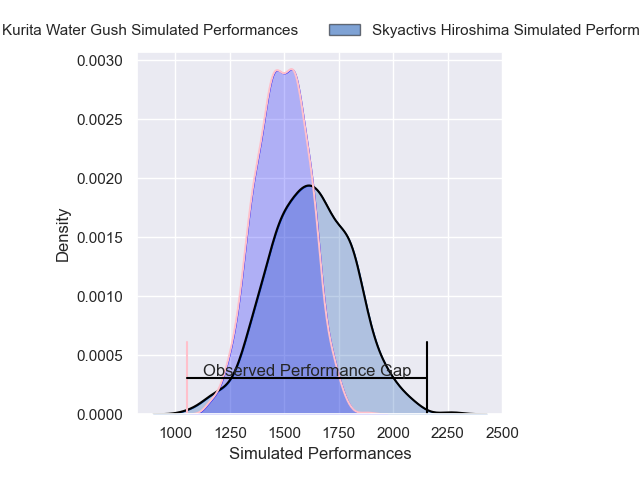
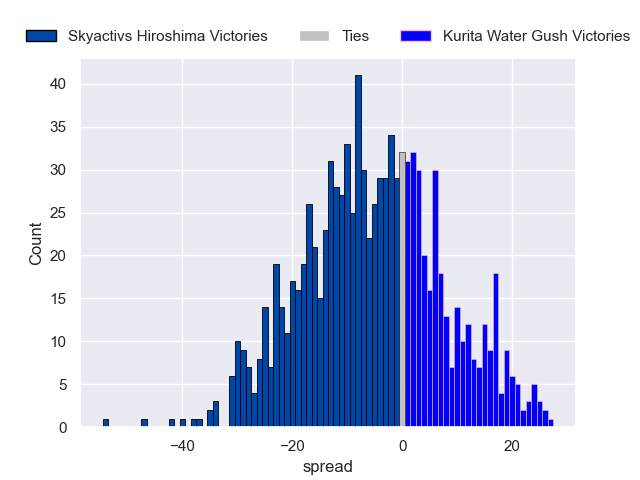
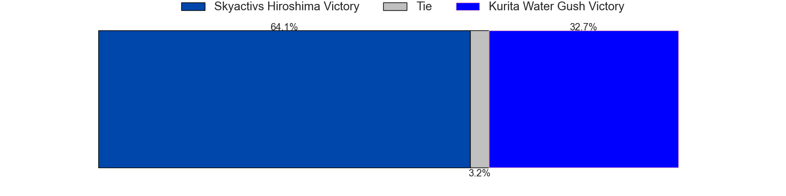

---  
layout: page  
title: Skyactivs Hiroshima V Kurita Water Gush on 2025/12/21  
date: 2025-12-21  
categories: "Japan Rugby League One D3 25/26" match projection  
---
# Skyactivs Hiroshima V Kurita Water Gush on 2025/12/21, 57.0 to 7.0

# Club Level Predictions

Now that the game has been played, lets see how the club predictions did. I predicted Skyactivs Hiroshima to win by 3.66, and Skyactivs Hiroshima won by 50.0. That's an absolute error of 46.3 for the margin of victory, while my average absolute error has been 13.9 over the past six months. This prediction was more accurate than 2.9% of my recent predictions.

For the Over/Under model, I predicted a total of 57.5 and we have an actual total of 64.0. That's an absolute error of 6.5 compared to a six month average of 12.8. This prediction was more accurate than 67.4% of my recent predictions.
## Projected Performances - Club Model

## Projected Spreads - Club Model

## Projected Results - Club Model

