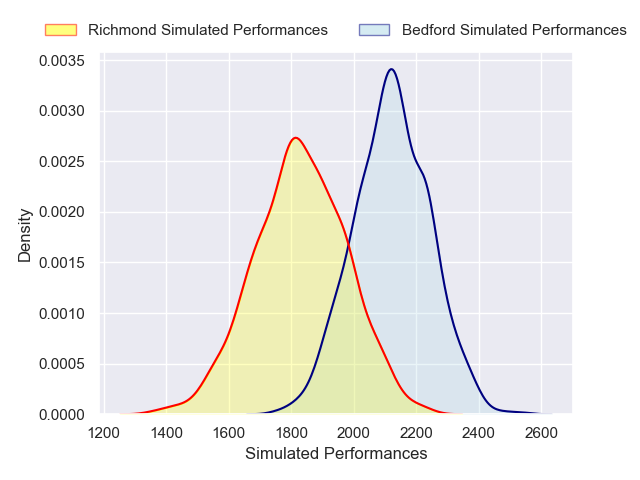
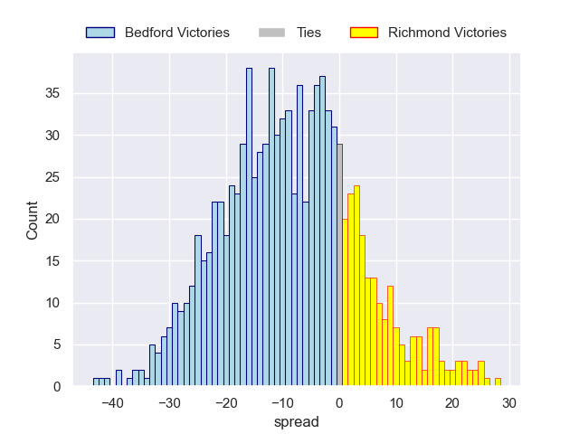

---  
layout: page  
title: Bedford V Richmond on 2025/12/26  
date: 2025-12-26  
categories: "RFU Championship 25/26" match projection  
---
# Bedford V Richmond on 2025/12/26, 33.0 to 10.0

# Club Level Predictions

Now that the game has been played, lets see how the club predictions did. I predicted Bedford to win by 8.21, and Bedford won by 23.0. That's an absolute error of 14.8 for the margin of victory, while my average absolute error has been 13.8 over the past six months. This prediction was more accurate than 35.4% of my recent predictions.

For the Over/Under model, I predicted a total of 53.5 and we have an actual total of 43.0. That's an absolute error of 10.5 compared to a six month average of 12.8. This prediction was more accurate than 48.9% of my recent predictions.
## Projected Performances - Club Model

## Projected Spreads - Club Model

## Projected Results - Club Model

