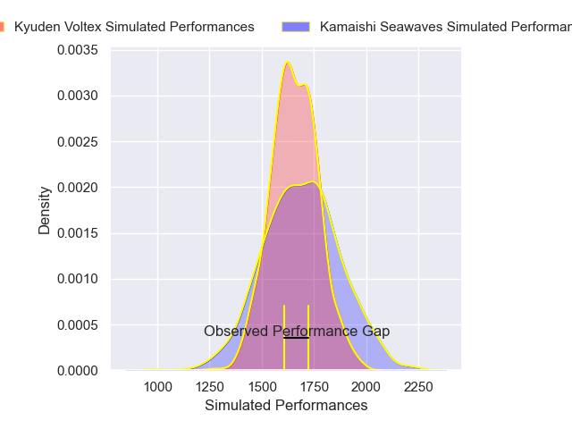
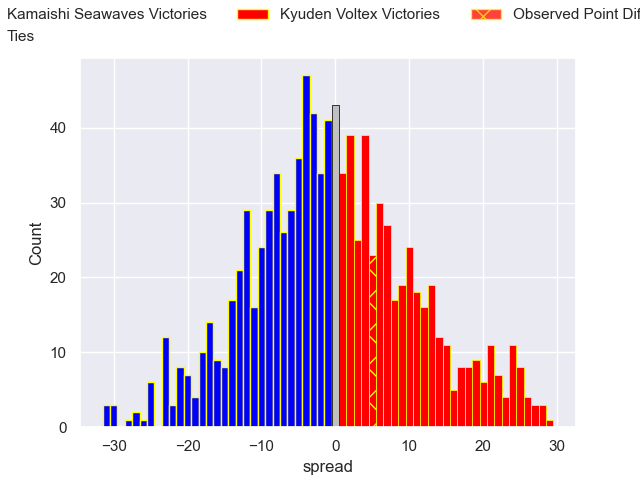
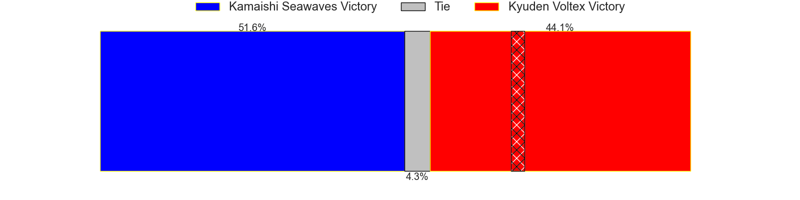

---  
layout: page  
title: Kamaishi Seawaves V Kyuden Voltex on 2025/12/26  
date: 2025-12-26  
categories: "Japan Rugby League One D2 25/26" match projection  
---
# Kamaishi Seawaves V Kyuden Voltex on 2025/12/26, 17.0 to 22.0

# Club Level Predictions

Now that the game has been played, lets see how the club predictions did. I predicted Kamaishi Seawaves to win by 0.38, and Kyuden Voltex won by 5.0. That's an absolute error of 5.4 for the margin of victory, while my average absolute error has been 13.8 over the past six months. This prediction was more accurate than 72.8% of my recent predictions.

For the Over/Under model, I predicted a total of 53.5 and we have an actual total of 39.0. That's an absolute error of 14.5 compared to a six month average of 12.8. This prediction was more accurate than 35.2% of my recent predictions.
## Projected Performances - Club Model

## Projected Spreads - Club Model

## Projected Results - Club Model

