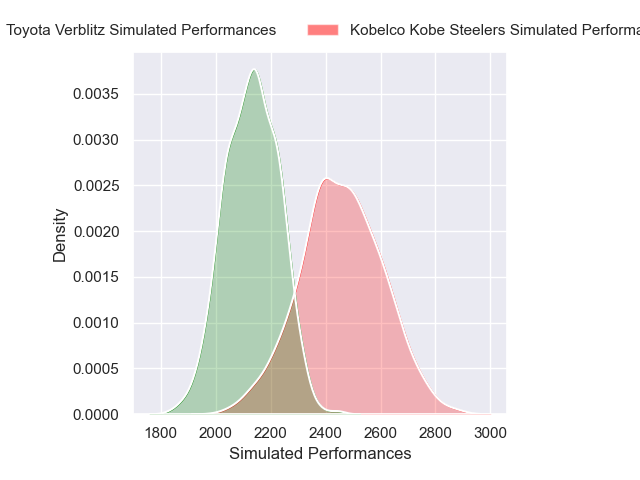
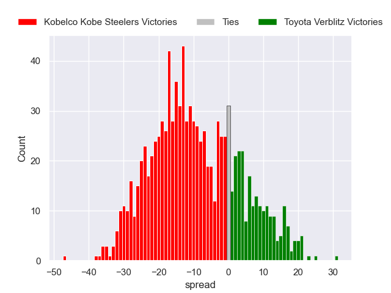
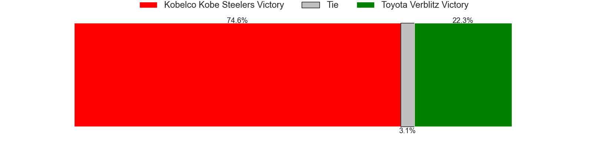

---  
layout: page  
title: Kobelco Kobe Steelers V Toyota Verblitz on 2025/12/26  
date: 2025-12-26  
categories: "Japan Rugby League One 25/26" match projection  
---
# Kobelco Kobe Steelers V Toyota Verblitz on 2025/12/26, 49.0 to 29.0

# Club Level Predictions

Now that the game has been played, lets see how the club predictions did. I predicted Kobelco Kobe Steelers to win by 9.45, and Kobelco Kobe Steelers won by 20.0. That's an absolute error of 10.6 for the margin of victory, while my average absolute error has been 13.8 over the past six months. This prediction was more accurate than 48.1% of my recent predictions.

For the Over/Under model, I predicted a total of 56.5 and we have an actual total of 78.0. That's an absolute error of 21.5 compared to a six month average of 12.8. This prediction was more accurate than 18.2% of my recent predictions.
## Projected Performances - Club Model

## Projected Spreads - Club Model

## Projected Results - Club Model

