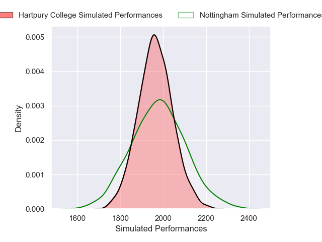
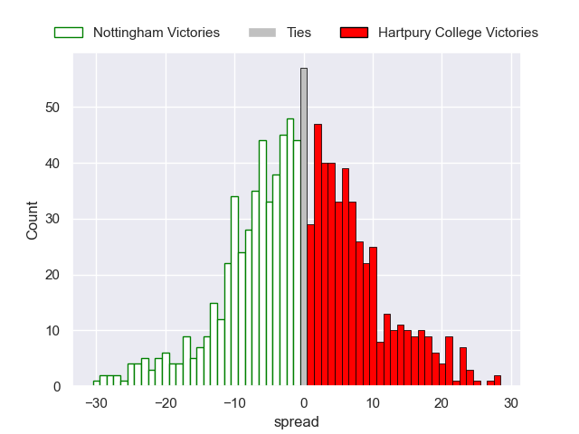

---  
layout: page  
title: Nottingham V Hartpury College on 2025/12/26  
date: 2025-12-26  
categories: "RFU Championship 25/26" match projection  
---
# Nottingham V Hartpury College on 2025/12/26, 38.0 to 24.0

# Club Level Predictions

Now that the game has been played, lets see how the club predictions did. I predicted Nottingham to win by 0.27, and Nottingham won by 14.0. That's an absolute error of 13.7 for the margin of victory, while my average absolute error has been 13.8 over the past six months. This prediction was more accurate than 37.8% of my recent predictions.

For the Over/Under model, I predicted a total of 53.5 and we have an actual total of 62.0. That's an absolute error of 8.5 compared to a six month average of 12.8. This prediction was more accurate than 59.1% of my recent predictions.
## Projected Performances - Club Model

## Projected Spreads - Club Model

## Projected Results - Club Model

