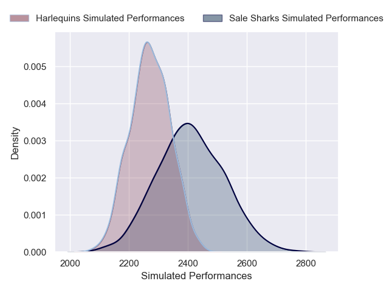
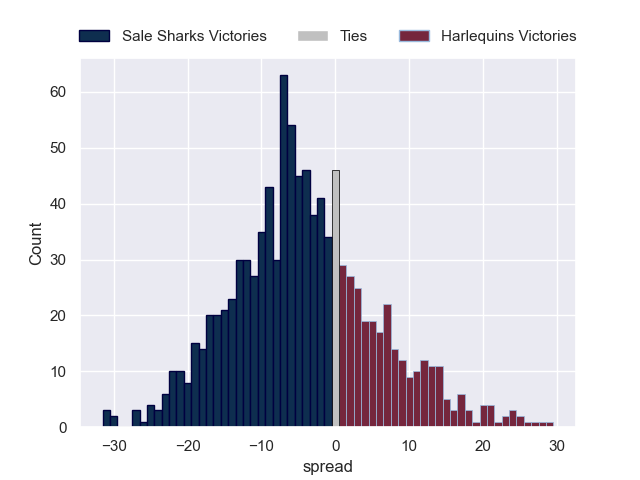

---  
layout: page  
title: Sale Sharks V Harlequins on 2025/12/26  
date: 2025-12-26  
categories: "Gallagher Premiership 25/26" match projection  
---
# Sale Sharks V Harlequins on 2025/12/26, 43.0 to 17.0

# Club Level Predictions

Now that the game has been played, lets see how the club predictions did. I predicted Sale Sharks to win by 4.85, and Sale Sharks won by 26.0. That's an absolute error of 21.2 for the margin of victory, while my average absolute error has been 13.8 over the past six months. This prediction was more accurate than 22.3% of my recent predictions.

For the Over/Under model, I predicted a total of 55.5 and we have an actual total of 60.0. That's an absolute error of 4.5 compared to a six month average of 12.8. This prediction was more accurate than 77.0% of my recent predictions.
## Projected Performances - Club Model

## Projected Spreads - Club Model

## Projected Results - Club Model

