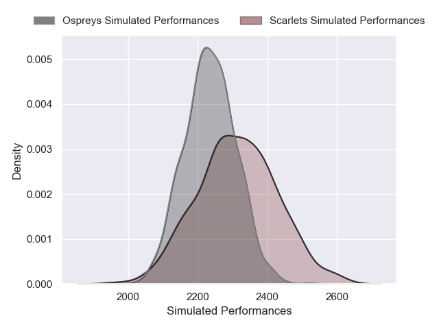
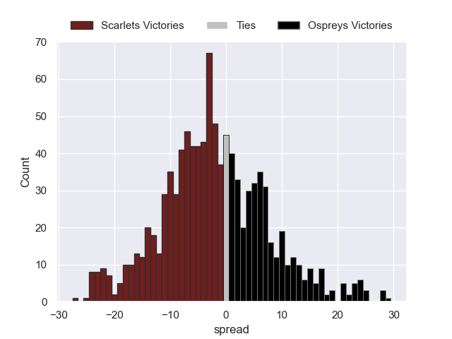

---  
layout: page  
title: Scarlets V Ospreys on 2025/12/26  
date: 2025-12-26  
categories: "United Rugby Championship 25/26" match projection  
---
# Scarlets V Ospreys on 2025/12/26, 19.0 to 26.0

# Club Level Predictions

Now that the game has been played, lets see how the club predictions did. I predicted Scarlets to win by 2.99, and Ospreys won by 7.0. That's an absolute error of 10.0 for the margin of victory, while my average absolute error has been 13.8 over the past six months. This prediction was more accurate than 49.8% of my recent predictions.

For the Over/Under model, I predicted a total of 46.5 and we have an actual total of 45.0. That's an absolute error of 1.5 compared to a six month average of 12.8. This prediction was more accurate than 92.4% of my recent predictions.
## Projected Performances - Club Model

## Projected Spreads - Club Model

## Projected Results - Club Model

