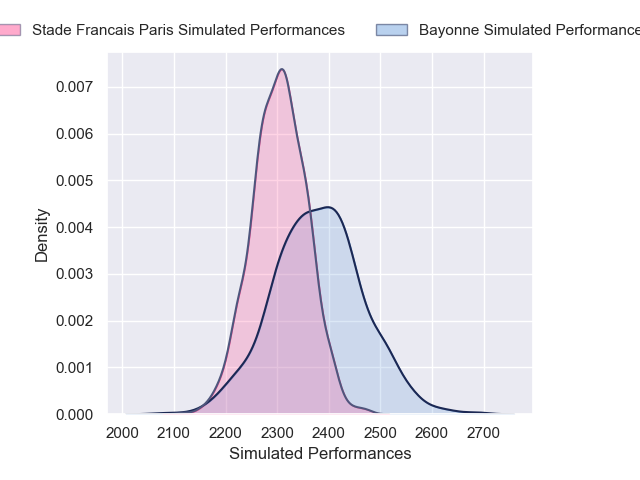
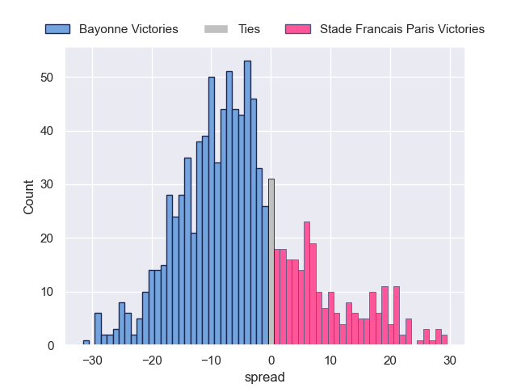

---  
layout: page  
title: Bayonne V Stade Francais Paris on 2025/12/27  
date: 2025-12-27  
categories: "Top 14 25/26" match projection  
---
# Bayonne V Stade Francais Paris on 2025/12/27, 35.0 to 34.0

# Club Level Predictions

Now that the game has been played, lets see how the club predictions did. I predicted Bayonne to win by 3.17, and Bayonne won by 1.0. That's an absolute error of 2.2 for the margin of victory, while my average absolute error has been 13.8 over the past six months. This prediction was more accurate than 88.7% of my recent predictions.

For the Over/Under model, I predicted a total of 52.5 and we have an actual total of 69.0. That's an absolute error of 16.5 compared to a six month average of 12.8. This prediction was more accurate than 28.5% of my recent predictions.
## Projected Performances - Club Model

## Projected Spreads - Club Model

## Projected Results - Club Model

