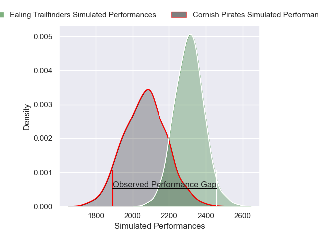

---  
layout: page  
title: Cornish Pirates V Ealing Trailfinders on 2025/12/27  
date: 2025-12-27  
categories: "RFU Championship 25/26" match projection  
---
# Cornish Pirates V Ealing Trailfinders on 2025/12/27, 14.0 to 41.0

# Club Level Predictions

Now that the game has been played, lets see how the club predictions did. I predicted Ealing Trailfinders to win by 7.34, and Ealing Trailfinders won by 27.0. That's an absolute error of 19.7 for the margin of victory, while my average absolute error has been 13.8 over the past six months. This prediction was more accurate than 25.3% of my recent predictions.

For the Over/Under model, I predicted a total of 62.5 and we have an actual total of 55.0. That's an absolute error of 7.5 compared to a six month average of 12.8. This prediction was more accurate than 62.6% of my recent predictions.
## Projected Performances - Club Model

## Projected Spreads - Club Model

## Projected Results - Club Model

