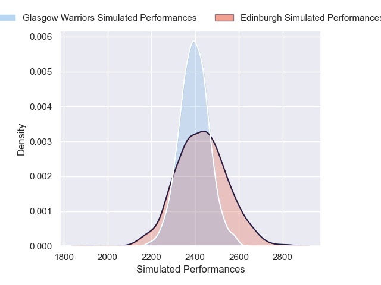
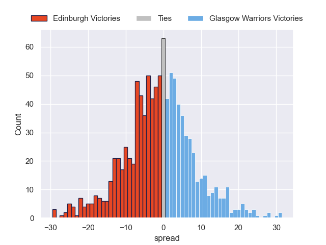

---  
layout: page  
title: Edinburgh V Glasgow Warriors on 2025/12/27  
date: 2025-12-27  
categories: "United Rugby Championship 25/26" match projection  
---
# Edinburgh V Glasgow Warriors on 2025/12/27, 3.0 to 21.0

# Club Level Predictions

Now that the game has been played, lets see how the club predictions did. I predicted Edinburgh to win by 1.81, and Glasgow Warriors won by 18.0. That's an absolute error of 19.8 for the margin of victory, while my average absolute error has been 13.8 over the past six months. This prediction was more accurate than 25.2% of my recent predictions.

For the Over/Under model, I predicted a total of 45.5 and we have an actual total of 24.0. That's an absolute error of 21.5 compared to a six month average of 12.8. This prediction was more accurate than 18.2% of my recent predictions.
## Projected Performances - Club Model

## Projected Spreads - Club Model

## Projected Results - Club Model

