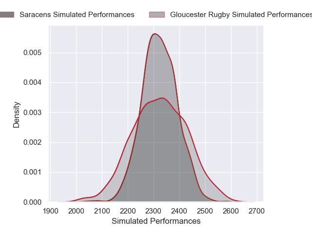
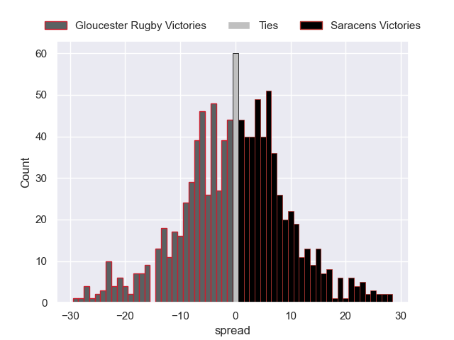

---  
layout: page  
title: Gloucester Rugby V Saracens on 2025/12/27  
date: 2025-12-27  
categories: "Gallagher Premiership 25/26" match projection  
---
# Gloucester Rugby V Saracens on 2025/12/27, 21.0 to 30.0

# Club Level Predictions

Now that the game has been played, lets see how the club predictions did. I predicted Gloucester Rugby to win by 0.33, and Saracens won by 9.0. That's an absolute error of 9.3 for the margin of victory, while my average absolute error has been 13.8 over the past six months. This prediction was more accurate than 52.4% of my recent predictions.

For the Over/Under model, I predicted a total of 55.5 and we have an actual total of 51.0. That's an absolute error of 4.5 compared to a six month average of 12.8. This prediction was more accurate than 77.0% of my recent predictions.
## Projected Performances - Club Model

## Projected Spreads - Club Model

## Projected Results - Club Model

