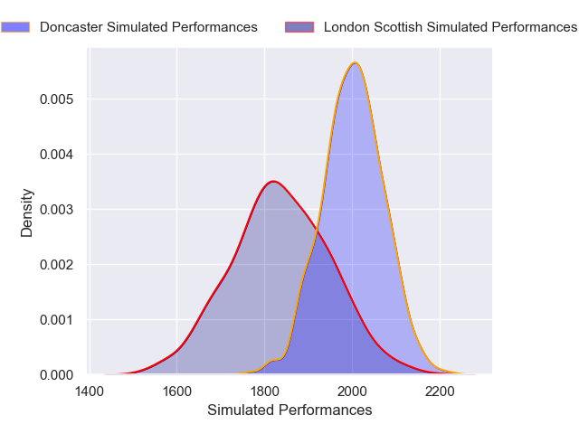
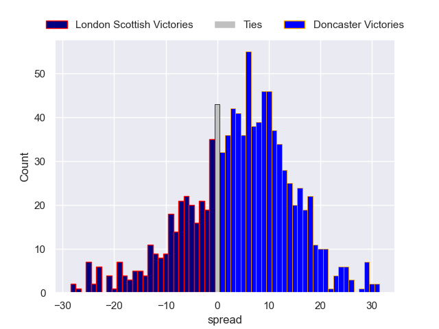

---  
layout: page  
title: London Scottish V Doncaster on 2025/12/27  
date: 2025-12-27  
categories: "RFU Championship 25/26" match projection  
---
# London Scottish V Doncaster on 2025/12/27, 34.0 to 10.0

# Club Level Predictions

Now that the game has been played, lets see how the club predictions did. I predicted Doncaster to win by 4.5, and London Scottish won by 24.0. That's an absolute error of 28.5 for the margin of victory, while my average absolute error has been 13.8 over the past six months. This prediction was more accurate than 11.7% of my recent predictions.

For the Over/Under model, I predicted a total of 57.5 and we have an actual total of 44.0. That's an absolute error of 13.5 compared to a six month average of 12.8. This prediction was more accurate than 38.6% of my recent predictions.
## Projected Performances - Club Model

## Projected Spreads - Club Model

## Projected Results - Club Model

