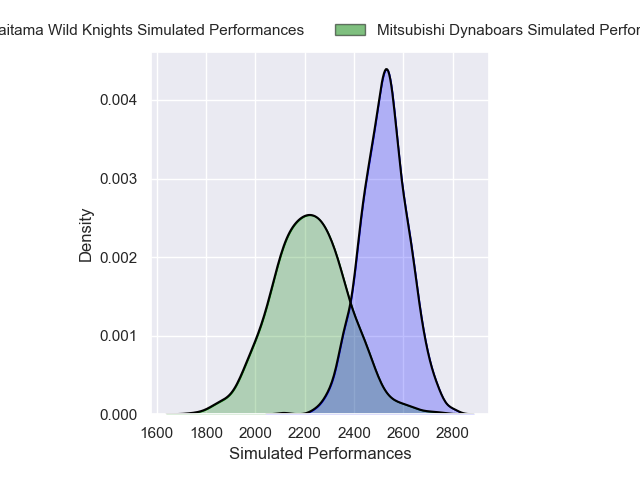
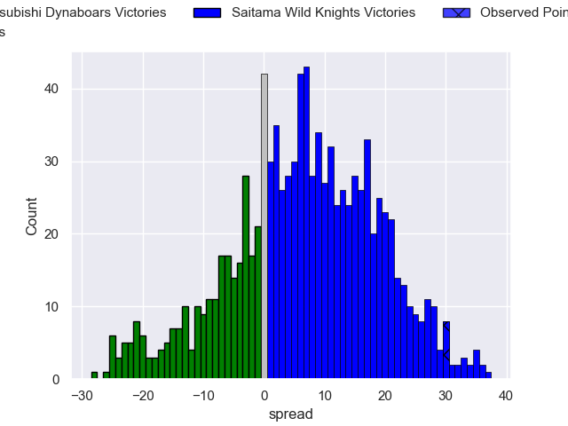
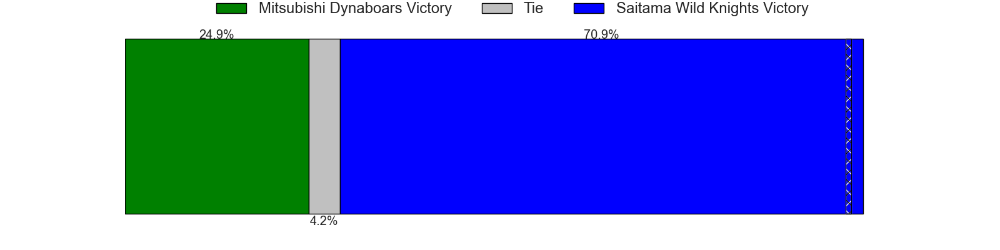

---  
layout: page  
title: Mitsubishi Dynaboars V Saitama Wild Knights on 2025/12/27  
date: 2025-12-27  
categories: "Japan Rugby League One 25/26" match projection  
---
# Mitsubishi Dynaboars V Saitama Wild Knights on 2025/12/27, 3.0 to 33.0

# Club Level Predictions

Now that the game has been played, lets see how the club predictions did. I predicted Saitama Wild Knights to win by 6.71, and Saitama Wild Knights won by 30.0. That's an absolute error of 23.3 for the margin of victory, while my average absolute error has been 13.8 over the past six months. This prediction was more accurate than 18.6% of my recent predictions.

For the Over/Under model, I predicted a total of 62.5 and we have an actual total of 36.0. That's an absolute error of 26.5 compared to a six month average of 12.8. This prediction was more accurate than 10.8% of my recent predictions.
## Projected Performances - Club Model

## Projected Spreads - Club Model

## Projected Results - Club Model

