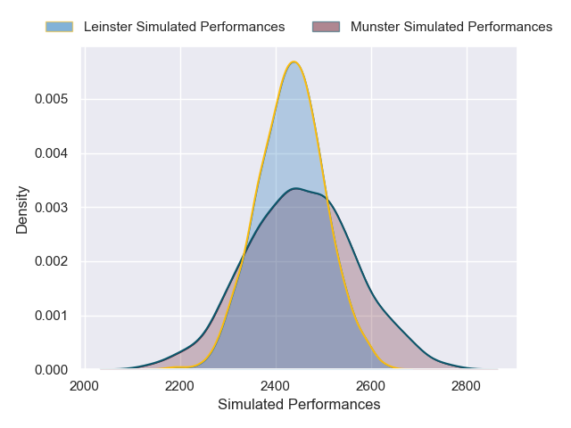

---  
layout: page  
title: Munster V Leinster on 2025/12/27  
date: 2025-12-27  
categories: "United Rugby Championship 25/26" match projection  
---
# Munster V Leinster on 2025/12/27, 8.0 to 13.0

# Club Level Predictions

Now that the game has been played, lets see how the club predictions did. I predicted Munster to win by 0.81, and Leinster won by 5.0. That's an absolute error of 5.8 for the margin of victory, while my average absolute error has been 13.8 over the past six months. This prediction was more accurate than 70.1% of my recent predictions.

For the Over/Under model, I predicted a total of 43.5 and we have an actual total of 21.0. That's an absolute error of 22.5 compared to a six month average of 12.8. This prediction was more accurate than 16.8% of my recent predictions.
## Projected Performances - Club Model

## Projected Spreads - Club Model

## Projected Results - Club Model

