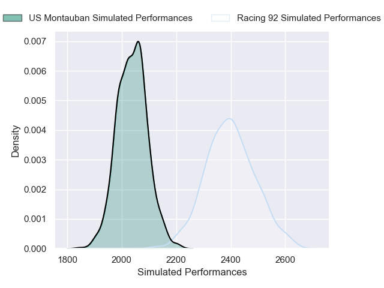
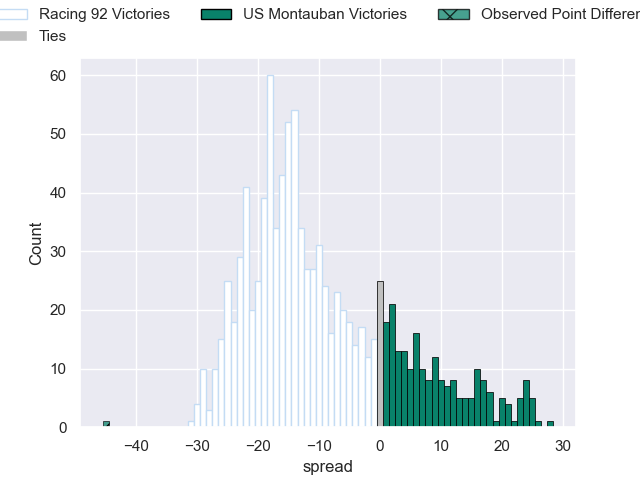
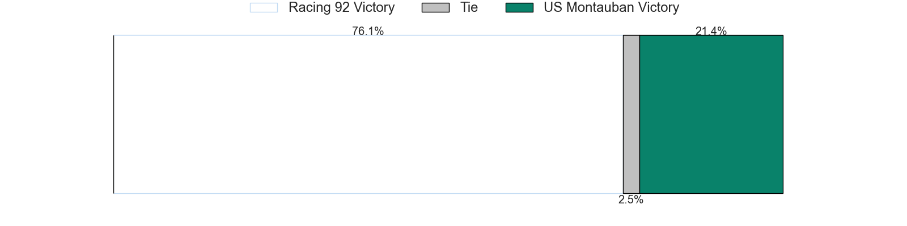

---  
layout: page  
title: Racing 92 V US Montauban on 2025/12/27  
date: 2025-12-27  
categories: "Top 14 25/26" match projection  
---
# Racing 92 V US Montauban on 2025/12/27, 61.0 to 16.0

# Club Level Predictions

Now that the game has been played, lets see how the club predictions did. I predicted Racing 92 to win by 9.47, and Racing 92 won by 45.0. That's an absolute error of 35.5 for the margin of victory, while my average absolute error has been 13.8 over the past six months. This prediction was more accurate than 6.0% of my recent predictions.

For the Over/Under model, I predicted a total of 53.5 and we have an actual total of 77.0. That's an absolute error of 23.5 compared to a six month average of 12.8. This prediction was more accurate than 14.9% of my recent predictions.
## Projected Performances - Club Model

## Projected Spreads - Club Model

## Projected Results - Club Model

